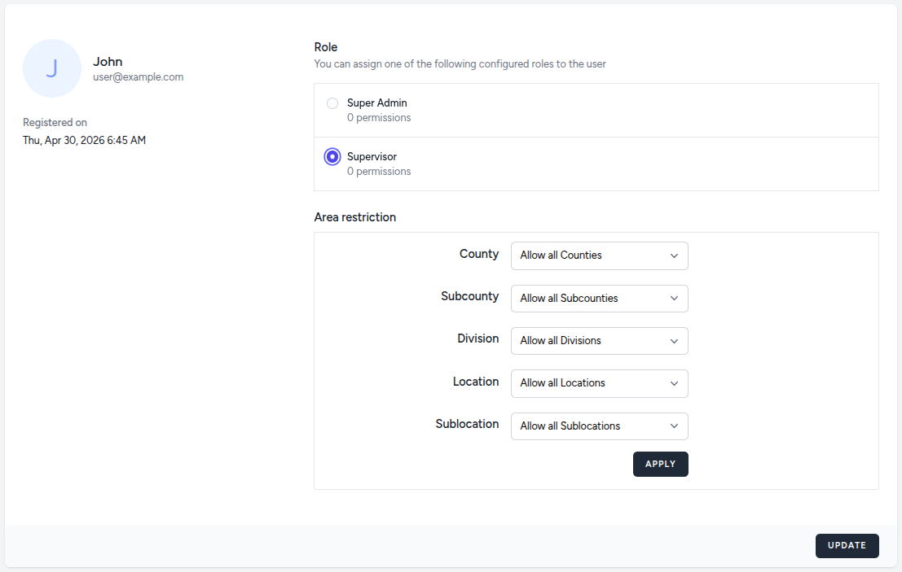

# Area Restrictions

The Area Restriction feature allows Administrators to manage data visibility for specific users by scoping their access to a defined geographic boundary.

When an Area Restriction is applied to an account, the entire dashboard environment—including all metrics, reports, and visualizations—is filtered to display only information pertaining to the selected area and its nested sub-areas.

How it works is, an Administrator selects a specific area by using the area drill down menu and can apply the restriction at any level of the geographic hierarchy.

