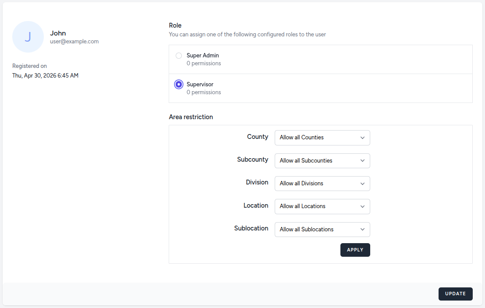

# Area Restrictions

The **Area Restriction** feature allows administrators to manage data visibility for specific users by scoping their access to a defined geographic boundary.

When an Area Restriction is applied to a user account, the entire dashboard environment — including all metrics, reports, and visualizations — is filtered to display only information pertaining to the selected area and its nested sub-areas.

## How It Works

1. Navigate to the **Users** management page.
2. Click **Edit** next to the user you want to restrict.
3. Use the area drill-down selector to choose a specific area.
4. Apply the restriction at any level of the geographic hierarchy (e.g., restrict a user to see only data for a specific County, and all its sub-areas).

The user will then only see data for their assigned area and its children, regardless of which page or indicator they are viewing.

## Use Cases

- **Regional Supervisors:** Restrict supervisors to only see data for their assigned region.
- **Field Officers:** Limit access to specific districts or EAs where the officer is deployed.
- **Data Partners:** Grant external partners access to only the geographic areas relevant to their project.

