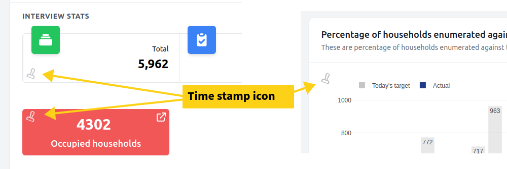

# Caching

The Dashboard Starter Kit comes with a complete caching strategy built in.

## Automatic Caching

Caching happens automatically behind the scenes. Every published indicator, scorecard, case stat, and map indicator is cached for a set amount of time determined by the `CACHE_TTL_SECONDS` setting in your `.env` file. The default cache duration is **thirty minutes**.

## Custom Caching Strategy

For production environments, you will likely want to implement your own caching strategy appropriate to your data size and requirements. This is achieved by using the `chimera:cache` group of commands and scheduling them using Laravel's task scheduler.

Data cached using any of the cache commands does not expire — it is cached "forever." Cache replacement is left to the developer and should be managed through a well-thought-out schedule of cache update commands.

For details, refer to the [Task Scheduling](https://laravel.com/docs/13.x/scheduling#main-content) section of the Laravel documentation.

```php
$schedule->command('chimera:cache --data-source=enumeration')->everySixHours();
```

Add this type of code to the `schedule()` method of your `App\Console\Kernel` class (or via `bootstrap/app.php` in newer Laravel versions) for each of your cache commands.

## Cache Commands

The following commands are available for caching different artefact types:

```bash
php artisan chimera:cache-indicators
php artisan chimera:cache-scorecards
php artisan chimera:cache-mapindicators
php artisan chimera:cache-casestats
```

### chimera:cache-indicators

This command has three options to control how caching occurs:

- **`--max-level`:** Controls the depth of caching for indicators. By default, only the national and first area levels are cached. Accepts a number between 1 and the total number of area hierarchies you have.
- **`--data-source`:** Updates the cache of indicators belonging to a specific data source. By default, indicators across all data sources are updated.
- **`--tag`:** Specifically targets indicators that have been assigned the given tag, excluding all other untagged indicators.

**Examples:**

```bash
# Update all published, untagged indicators
php artisan chimera:cache-indicators

# Update indicators for a specific data source
php artisan chimera:cache-indicators --data-source=enumeration

# Update indicators with the 'priority' tag
php artisan chimera:cache-indicators --tag=priority
```

:::info
You can manage the tag list by editing the `tags` key in the Chimera cache config.

**Example** (in `config/chimera.php`):

```php
'cache' => [
    'ttl' => env('CACHE_TTL_SECONDS', 60 * 30),
    'tags' => ['priority', 'secondary'],
],
```

After configuring tags, you will see a **Cache Tags** dropdown when editing indicators. By default, indicators have no assigned tag. You only need to assign tags to indicators you want to target specifically with the `--tag` option.
:::

### chimera:cache-scorecards

This command has one option:

- **`--data-source`:** Updates the cache of scorecards belonging to a specific data source. By default, scorecards across all data sources are updated.

### chimera:cache-mapindicators

This command has one option:

- **`--data-source`:** Updates the cache of map indicators belonging to a specific data source. By default, map indicators across all data sources are updated.

### chimera:cache-casestats

This command has one option:

- **`--data-source`:** Updates the cache of CaseStats belonging to a specific data source. By default, CaseStats across all data sources are updated.

## Cache Clearing

If you need to clear cached data, use the `chimera:cache-clear` command. It has two options:

- **`--data-source`:** Clears the cache of all items stored under the given data source.
- **`--type`:** Clears specific types of cached data. Possible values: `indicators`, `scorecards`, `casestats`, or `mapindicators`.

:::danger
Executing `chimera:cache-clear` without any options will clear **everything** from the cache. Consider this carefully before running the command.
:::

## Cache Timestamp Display

When caching is enabled, a small, faded rubber stamp icon appears on each indicator, scorecard, and case stats table.

When hovered over, it displays the time at which the cached data was generated.


