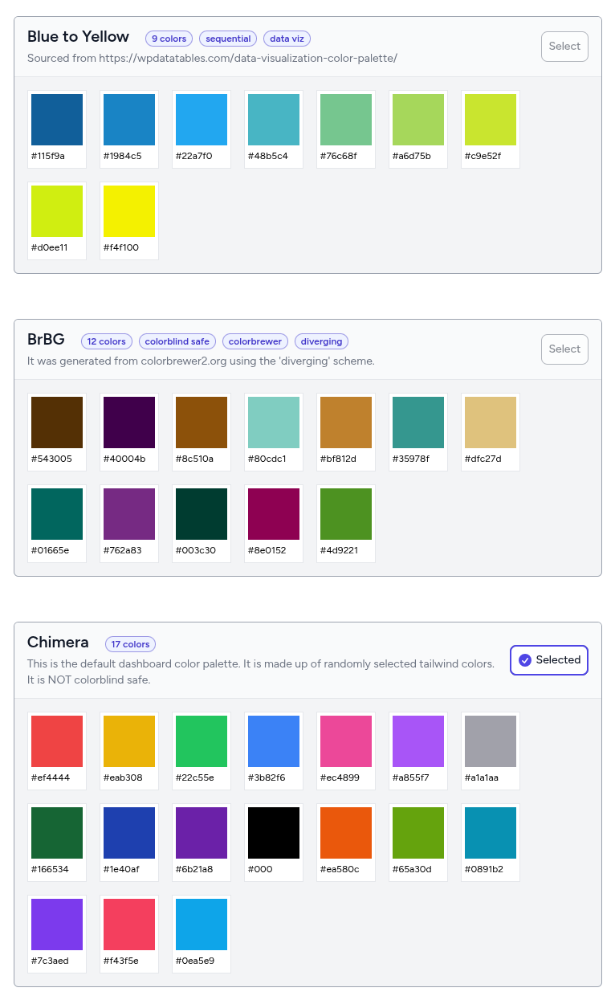

# Customizing Branding

The dashboard can be customized to have the logos and other assets of the organization that owns it.

## Changing the logo
There are two different resources that control the logo graphics used in the dashboard.

One for the login page `resources/views/components/authentication-card-logo.blade.php` and another for everywhere else `resources/views/components/application-mark.blade.php`

By changing the contents of these two files, you can change the logo graphics. Both these resources are of SVG code and we advice that you replace them with either the SVG code of your logo or an SVG file format of your logo.

To change the hero image on the landing page (welcome page), replace it `public/images/hero.jpg` with a file of the same name.

You are also able to control the color of charts, scorecards and other graphics in the dashboard by creating your own color palettes.

## Color palettes
You can apply one of the available color palettes that come included with the dashboard. The colors in the selected palette will apply to dashboard elements such as charts, scorecards and cards. The right color will be chosen for text sitting on top of these colors according to Web Content Accessibility Guidelines (WCAG-3/APCA), which will ensure the correct amount of contrast for readability.

### A brief primer on data visualization colors
Color improves a visualization's aesthetic quality, as well as its ability to effectively communicate about its data. The colors used for data visualization can generally be classified into three palettes. Read more [here](https://spectrum.adobe.com/page/color-for-data-visualization/).

