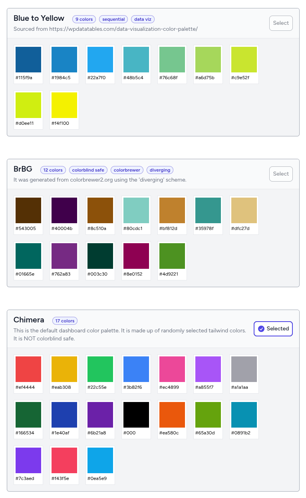

# Customizing Branding

The dashboard can be customized with your organization's logos and branding assets.

## Changing the Logo

Two different template files control the logo graphics used in the dashboard:

- **Login page:** `resources/views/components/authentication-card-logo.blade.php`
- **Everywhere else:** `resources/views/components/application-mark.blade.php`

By modifying these files, you can replace the default logo with your organization's branding. We recommend using SVG code or an SVG file format for your logo for the best quality and scalability.

## Changing the Hero Image

To change the hero image on the landing (welcome) page, replace the file at `public/images/hero.jpg` with your own image, using the same filename.

## Color Palettes

You can apply one of the available color palettes that come included with the dashboard. The colors in the selected palette will apply to dashboard elements such as charts, scorecards, and data cards. The appropriate text color is automatically chosen based on Web Content Accessibility Guidelines (WCAG 3 / APCA), ensuring the correct contrast ratio for readability.

### A Brief Primer on Data Visualization Colors

Color improves both a visualization's aesthetic quality and its ability to effectively communicate data. Colors used for data visualization generally fall into three categories:

- **Categorical:** Distinct colors for different categories with no inherent order (e.g., regions, product types).
- **Sequential:** A gradient from light to dark representing low to high values (e.g., population density).
- **Diverging:** Two contrasting colors meeting at a neutral midpoint, useful for showing deviation from a center value (e.g., temperature anomalies).

Read more about color for data visualization in the [Adobe Spectrum guide](https://spectrum.adobe.com/page/color-for-data-visualization/).

