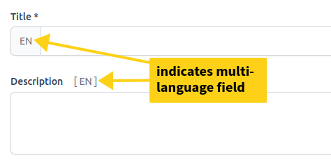

# Localization

Everything in the dashboard can be localized to any language — this includes the interface language and the data displayed in artefacts.

## Interface Localization

The interface is localized through Laravel's language files. You can read more about this in the [Laravel Localization documentation](https://laravel.com/docs/localization). As of now, we provide translations for:

- **English** (EN)
- **French** (FR)
- **Portuguese** (PT)

Users can switch the interface language using the language switcher in the navigation bar.

## Data Localization

Data fields such as indicator titles, descriptions, page names, and report titles can be localized directly from the **Management** section of the dashboard.

All localizable fields are displayed with a special multi-language input component:

### How to Add Translations

1. Switch your interface language using the language switcher (e.g., select **FR** for French).
2. Navigate to the Management section and edit the artefact you want to translate.
3. The localizable fields will display the language code (e.g., **FR**) as a label.
4. Enter the translation for that language and save.

That's it! The translated values will be displayed whenever a user views the dashboard in that language.

> **Tip:** You do not need to provide translations for all languages. Fields without a translation for the current language will fall back to the default (English) value.
