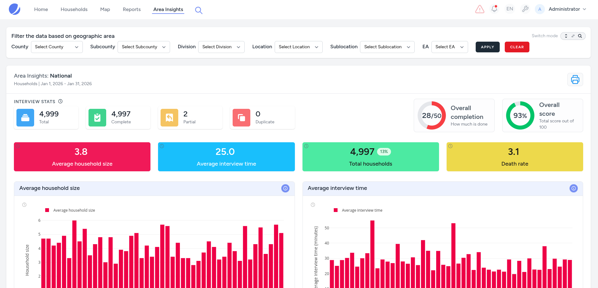

# Area Insights

The Area Insights page is a dynamic and powerful tool designed to provide a comprehensive, yet high level snapshot of field operations and thematic indicators of geographic areas. It translates complex datasets into actionable intelligence through a combination of high-level grading gauges, scorecards and interactive visualizations.

You can utilize the filter bar (area filter) to narrow data from a National overview down to specific areas, even EAs! 

The revamped filter bar now supports both drill-down and direct search-and-set modes which stay in sync.

