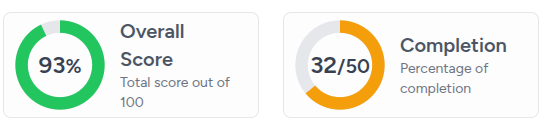

# Gauges
Gauges are meant to provide a clear visualization of a single metric relative to a predefined goal or maximum value. Unlike standard bar charts, Gauges focus on proportionality and achievement. In addition to the numeric representation of achievement, color scales are used to obviate the score without much cognitive load.

## Creating Gauges
There are two ways to create gauges. A cli command and a web form.

The first way is by running the php artisan chimera:make-gauge command and following the various prompts. This works best when you are running a linux machine.

The second way is by going to the Manage dashboard menu and selecting Gauges, then pressing the CREATE NEW button and filling out the form as required.

Gauges usually display just three things: title, sub-title and value (with unit or reference).



## Implementing Gauges
Obviously, you will have to write some code in your generated gauge file so that it distills and returns the values you intend.

You have a high degree of freedom on how you choose to code your gauge as long as, at the end, you set the appropriate public class properties with their desired values. You have to return a Laravel Collection from the getData public method containing an object with a key called 'value'. This will be the value to display. You should also make sure the $unit, $outOf and $colorThresholds properties are set. The generated stub file will have all of these included.

- `$this->outOf`

    This is the mathematical denominator. It defines the "perfect score" or the target/maximum value for the gauge.

- `$this->colorThresholds`

    This is the semantic styling engine. It maps numerical values to CSS classes (Tailwind colors) to provide immediate "good/bad" status.

- `$this->unit`

    This is the display suffix. While $outOf handles the math, $unit handles the visual text rendered in the center of the gauge.

## Exercise

### Progress
Use these values to create a scorecard that displays the average household size of a given area.
- Data source: Kenya Census
- Scorecard name: KenyaCensus/AverageHouseholdSize
- Title: Average household size

After you have created the scorecard, navigate, in your IDE, to the `app/Livewire/Scorecard/KenyaCensus` directory and open the `AverageHouseholdSize.php` file.

You should see the following code:
```php
<?php

namespace App\Livewire\Gauge\KenyaCensus;

use Illuminate\Support\Collection;
use Uneca\Chimera\Livewire\GaugeComponent;
use Uneca\Chimera\Services\BreakoutQueryBuilder;

class Progress extends GaugeComponent
{
    // public string $unit = '%';
    // public array $colorThresholds = [30 => 'text-red-500', 40 => 'text-amber-500', 50 => 'text-green-500'];
    // public int $outOf = 100;

    public function getData(string $filterPath): Collection
    {
        try {
            // TODO: Implement getData() method.
        } catch (\Exception $exception) {
            return collect();
        }
    }
}
```


You can use the code below:
```php
<?php

namespace App\Livewire\Gauge\KenyaCensus;

use Illuminate\Support\Number;
use Illuminate\Support\Collection;
use Uneca\Chimera\Livewire\GaugeComponent;
use Uneca\Chimera\Services\BreakoutQueryBuilder;

class Progress extends GaugeComponent
{
    // public string $unit = '%';
    public array $colorThresholds = [50 => 'text-red-500', 70 => 'text-amber-500', 101 => 'text-green-500'];
    // public int $outOf = 100;

    public function getData(string $filterPath): Collection
    {
        try {
            return (new BreakoutQueryBuilder($this->gauge->data_source, $filterPath))
                ->select(['COUNT(*) AS total_households'])
                ->from(['housing_rec'])
                ->groupBy(['area_code'])
                ->lastlyAreaLeftJoinData(referenceValueToInclude: 'number_of_hh')
                ->get()
                ->map(function ($item) {
                    $item->value = Number::format(safeDivide($item->total_households, $item->ref_value) * 100, 1);
                    return $item;
                });
        } catch (\Exception $exception) {
            return collect();
        }
    }
}
    
```
