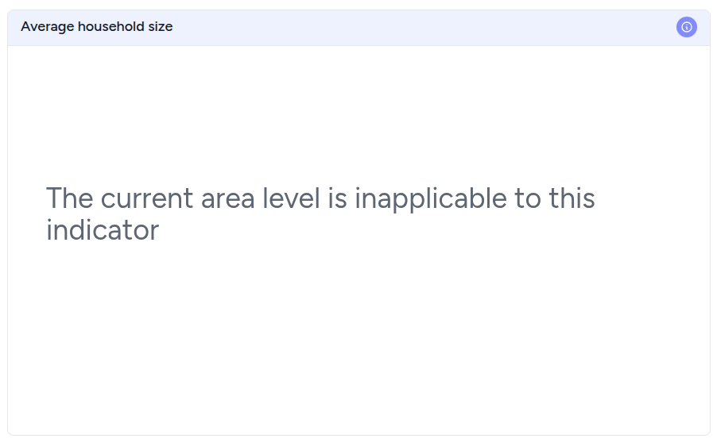

# Hierarchical Compatibility

This feature, often called **Granular Visibility Control**, allows dashboard creators to dictate exactly where a visualization "lives" within a geographic or organizational hierarchy.

Essentially, it prevents charts from displaying data at scales where they would be irrelevant, cluttered, or statistically insignificant.

## How the Feature Works
In any hierarchical dataset (E.g. **Country > State > District > City**), data behaves differently at each level. This setting acts as a conditional filter for the artefact's existence based on the user's current "zoom" or drill-down level.

## Why Use It?
* **Data Relevancy:** Some metrics only make sense at a high level. For example, a "National Market Share" pie chart is useful at the Country level but becomes redundant or broken if you've already filtered down to a single District.
* **Preventing "Visual Noise":** A scatter plot showing 10,000 data points might look great at a Country level but appear empty or "broken" at a District level if that specific district only has two data points.
* **Performance Optimization:** By disabling complex charts at broader levels (where they have to aggregate millions of rows), you can significantly speed up dashboard loading times.

### The User Experience
When a user drills down from the Country to a District:
1.  The dashboard detects the change in **Level of Detail**.
2.  The restricted chart gracefully displays a "Not available at this level" message.

