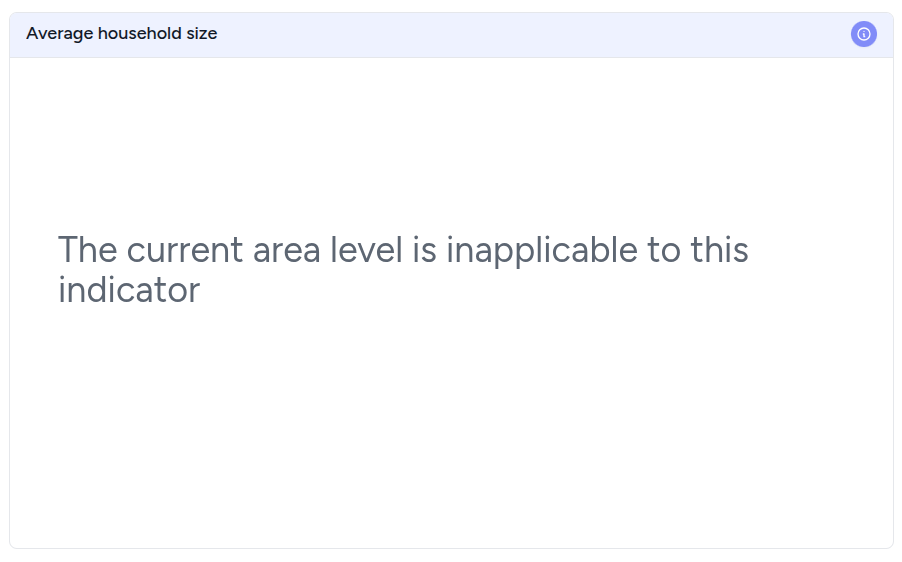

# Hierarchical Compatibility

This feature, often called **Granular Visibility Control**, allows dashboard creators to dictate exactly where a visualization appears within a geographic or organizational hierarchy.

Essentially, it prevents charts from displaying data at scales where they would be irrelevant, cluttered, or statistically insignificant.

## How It Works

In any hierarchical dataset (e.g., **Country > State > District > City**), data behaves differently at each level. The **Unsupported area levels** setting acts as a conditional filter for an artefact's visibility based on the user's current "zoom" or drill-down level.

## Why Use It?

- **Data Relevancy:** Some metrics only make sense at a high level. For example, a "National Market Share" pie chart is useful at the Country level but becomes meaningless if you have already filtered down to a single District.
- **Preventing Visual Noise:** A scatter plot showing 10,000 data points might look great at a Country level but appear empty or "broken" at a District level if that specific district only has two data points.
- **Performance Optimization:** By disabling complex charts at broader levels (where they must aggregate millions of rows), you can significantly speed up dashboard loading times.

## The User Experience

When a user drills down from the Country to a District:

1. The dashboard detects the change in **Level of Detail**.
2. Any restricted charts gracefully display a "Not available at this level" message.

## Configuring Hierarchical Compatibility

When editing an indicator, you will find the **Unsupported area levels** field. Select the geographic levels at which the indicator should **not** be displayed. For example, you might exclude the EA level for a chart that requires a minimum sample size to be statistically meaningful.
