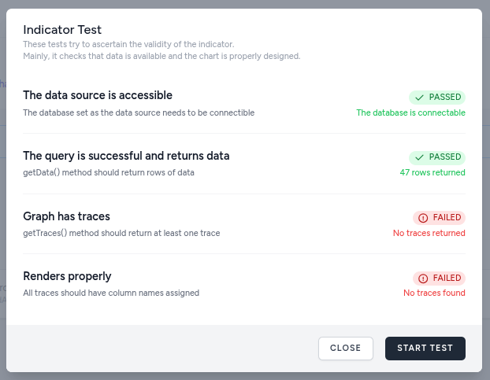
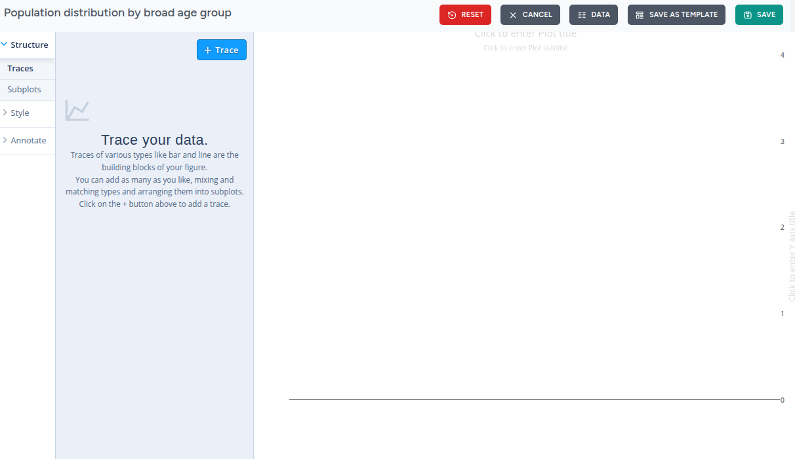
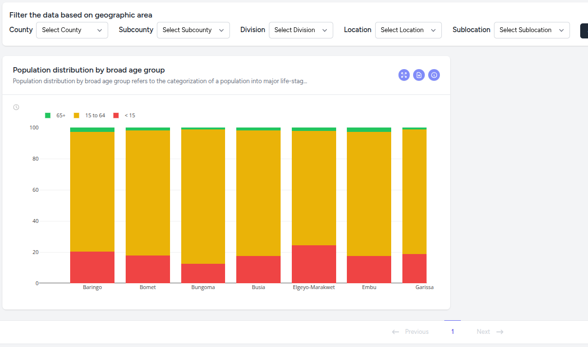

# Indicators

Indicators usually are data elements that represent statistical data for a specified time, place, and other characteristics. They are mostly depicted graphically in the form of common chart types such as bar, line, pie, and others.

They also include metadata for the indicator such as a brief description, title and and extended text that is meant to aid in understanding what is depicted by the indicator.

## Creating Indicators

Indicator creation involves either running a chimera command (interactive) on the command line or using a web form and will result in the creation of a file (component class) and addition of entries in to the database for created indicators, including permissions.

The created indicator file will contain the basics of an indicator, and it extends the base Chart class but will still require you to write some PHP code to implement your indicator fully.

The first way is by running the `php artisan chimera:make-indicator` command and following the various prompts. This works best when you are running a linux machine.

The second way is by going to the Manage dashboard menu and selecting Indicators, then pressing the CREATE NEW button and filling out the form as required.

Both methods allow you to control various aspects of the generated file.

You can choose to have some working sample code included in the generated file so that you can immediately start seeing realistic looking indicators in your dashboard.

:::caution
Please pay special attention when you provide a name for your indicator. It is what will became both the class and file name for you indicator and will create directories if you specify it.
When creating, please read the prompts and hints very carefully.
:::

## Implementing indicators
There are two possible versions your generated indicator file might have.

- **Minimal**

If you choose opt out of the inclusion of working sample code during the generation, you will end up with the following file.

```php
<?php

namespace App\Http\Livewire\Households;

use App\Http\Livewire\Chart;

class BirthRate extends Chart
{
    public function getData(string $filterPath): Collection
    {
        // TODO: Implement getData() method.
    }
}

```
If you publish it and see the results on the destination page, you will see an empty graph that displays a standard text stating the lack of data for the indicator.

- **With sample code**

If you choose to include sample code during the generation of the indicator, the resulting file will have a fully implemented getData() methods inside the class.

If you previewed it, you would see something a bar chart built with some fabricated data.

::: tip
While the getData() method can be implemented in any way you want as long as you return a Laravel collection from it, you would be better served if you used the included `BreakoutQueryBuilder` class to do it. This powerful class provides various helpful methods.
:::

## In the Sandbox
YIn our training sandbox, we wil be creating two indicators to demonstrate how they work. These will be based on the included Kenya Census database. Please follow the instructions below to create and experience them.

### Population distribution by broad age group
Use these values to create an indicator that displays the population distribution by broad age groups of a given area.
- Data Source: Kenya Census
- Name: KenyaCensus/PopulationDistributionByBroadAgeGroup
- Include sample code: No
- Title: Population distribution by broad age group
- Description: Categorization of a population into children (0–14), working-age adults (15–64), and the elderly (65+).

After you have created the indicator, navigate, in your IDE, to the `app/Livewire/KenyaCensus` directory and open the `PopulationDistributionByBroadAgeGroup.php` file.

You should see the following code:
```php
<?php

namespace App\Livewire\KenyaCensus;

use Illuminate\Support\Collection;
use Uneca\Chimera\Livewire\Chart;
use Uneca\Chimera\Services\BreakoutQueryBuilder;

class PopulationDistributionByBroadAgeGroup extends Chart
{
    // public bool $useDynamicAreaXAxisTitles = true;
    // public array $aggregateAppendedTraces = []; /* ['trace name' => 'avg'] ... sum, count, min, max, mode, median */

    public function getData(string $filterPath): Collection
    {
        try {
            // TODO: Implement getData() method.
        } catch (\Exception $exception) {
            return collect();
        }
    }
}
```

Where it says `TODO: Implement getData() method.` is where you will have to write the code to query the desired data from the database.

You can use the code below: (remember to include necessary imports)
```php
    return (new BreakoutQueryBuilder($this->indicator->data_source, $filterPath))
        ->select([
            'COUNT(*) AS total',
            'SUM(CASE WHEN p12 < 15 THEN 1 ELSE 0 END) AS less_than_15',
            'SUM(CASE WHEN p12 >= 15 AND p12 < 65 THEN 1 ELSE 0 END) AS between_15_and_65',
            'SUM(CASE WHEN p12 >= 65 THEN 1 ELSE 0 END) AS above_and_65'
        ])
        ->from(['pop_rec'])
        ->groupBy(['area_code'])
        ->lastlyAreaLeftJoinData()
        ->get()
        ->map(function ($item) {
            $item->less_than_15_percentage = Number::format(safeDivide($item->less_than_15, $item->total) * 100, 1);
            $item->between_15_and_65_percentage = Number::format(safeDivide($item->between_15_and_65, $item->total) * 100, 1);
            $item->above_and_65_percentage = Number::format(safeDivide($item->above_and_65, $item->total) * 100, 1);
            return $item;
        });
```

What you have just accomplished is for your new indicator to be able to return the necessary data from the database. The next step is to design the chart that will display the data. 

For this, navigate to the indicator management page and first click on the 'Test' button to make sure that your indicator is partially working and that it is returning the expected data. Once you have run the test, you should see something like this:


Next, click on the 'Design' button to open the indicator designer. You should see something like this:

It is a fully fledged charting tool that allows you to create and edit your chart. To understand the structure of the data that is being returned by your indicator, as per your query above, you can use the 'Data' button to see the data rendered as a table.

Add your three traces, one for each age group. Type should be 'bar', the x-axis should be 'area_name' and the y-axis should be the respective age group columns (percentage). You can rename the traces to a more human-readable name ('< 15', '15 to 64' and '65+' ) by clicking on the colored trace legend shown on the chart.

Then to to the 'Styles' section from the left tree menu find the 'Traces' sub-menu and set the 'Bar Mode' and 'Normalization' settings to 'Strict Sum Stacked' and 'Percent'. At this point, you can either continue to tweak the chart using the multitudes of options in the designer or you can press the 'Save' button and then exit the designer by pressing the 'Cancel' button.

Once you are back at the indicators management menu, you can verify your work by testing the indicator or you can use the 'Edit' button to publish it. While you are in the Editing interface, you will notice that there are additional fields such as the 'Contextual Help Text', 'Unsupported area levels', etc. The most important for now is the 'Page' option as you will need to create and publish a page so that your indicator will have a home where it will live.

Create a new indicators page and call it 'Households' and then add your indicator to it. At this point, if you navigate to the page, you should see something like this:


### Average household size
Use these values to create an indicator that displays the population distribution by broad age groups of a given area.
- Data Source: Kenya Census
- Name: KenyaCensus/AverageHouseholdSize
- Include sample code: No
- Title: Average household size
- Description: Mean number of people living in a single residential unit

After you have created the indicator, navigate, in your IDE, to the `app/Livewire/KenyaCensus` directory and open the `AverageHouseholdSize.php` file.

Where it says `TODO: Implement getData() method.` is where you will have to write the code to query the desired data from the database.

You can use the code below: (remember to include necessary imports)
```php
    return (new BreakoutQueryBuilder($this->indicator->data_source, $filterPath))
        ->select([
            'SUM(total_household_members) AS population',
            'COUNT(*) AS households'
        ])
        ->from(['housing_rec'])
        ->groupBy(['area_code'])
        ->lastlyAreaLeftJoinData()
        ->get()
        ->map(function ($i) {
            $i->average = Number::format(safeDivide($i->population, $i->households), 1);
            return $i;
        });
```

Remember to import the `Number` helper class on top of the file like so:
`use Illuminate\Support\Number;`

For the design, add a single trace of type 'Bar' and set the x-axis to 'area_name' and the y-axis to 'average'.
You can then add it to the already existing 'Households' page and publish it.

## Editing and Publishing
Editing and publishing indicators can be achieved via the 'Manage' menu.

There, you can edit indicator titles, descriptions, contextual help text and also provide multilingual translations for applicable fields.

You can also add the indicator to one or more of the pages you have already created.

The default state of indicators when they are created is to be in 'draft' mode. You can publish them so that they can become visible on the pages they are added to by using the status toggle button.

If you choose to, you can also feature any indicator on the home page under its respective data source summary section. A trophy icon indicates featured indicators in the management list.

You can also limit the scope of indicators so that they can only be displayed on either pages or area insights.

Sometimes data behaves differently at each level. The 'Unsupported area levels' setting acts as a conditional filter for the indicator's existence based on the user's current "zoom" or drill-down level. Essentially, it prevents charts from displaying data at scales where they would be irrelevant, cluttered, or statistically insignificant.

There is also cache tagging which can be used to target specific indicators for caching when using the cache commands (see advanced section).

## Deleting
Deleting indicators (including permissions and database entry) can be accomplished by using the generic chimera:delete command

```
php artisan chimera:delete
```
