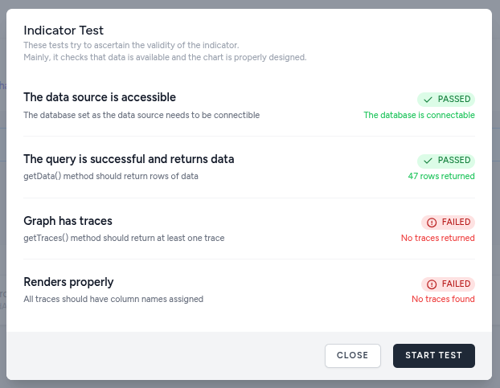
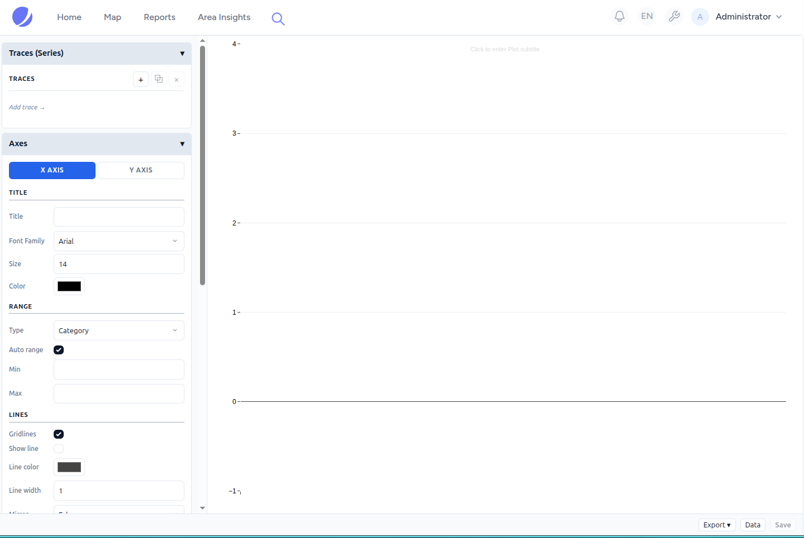
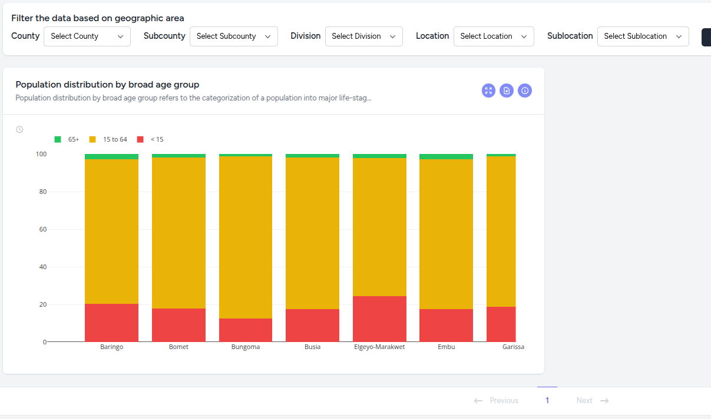

# Indicators

Indicators are data elements that represent statistical data for a specified time, place, and other characteristics. They are typically displayed graphically as common chart types such as bar charts, line charts, pie charts, and others.

Each indicator also includes metadata such as a title, a brief description, and extended contextual help text that aids users in understanding what the chart depicts.


## Creating Indicators

There are two ways to create indicators: via a CLI command or through a web form. Both methods result in the creation of a component class file and database entries for the indicator, including permissions.

### Method 1: CLI Command

Run the `php artisan chimera:make-indicator` command and follow the prompts. This method works best on Linux/macOS/WSL environments.

### Method 2: Web Form

Navigate to the **Management** menu, select **Indicators**, then press the **CREATE NEW** button and fill out the form as required.

Both methods allow you to control various aspects of the generated file. You can choose to include working sample code in the generated file so that you can immediately see realistic-looking indicators in your dashboard.

:::caution
Pay special attention to the name you provide for your indicator. It becomes both the class name and file name, and will create directories if you specify nested paths (e.g., `KenyaCensus/PopulationDistribution`). When creating, read the prompts and hints carefully.
:::

## Implementing Indicators

Your generated indicator file will come in one of two versions depending on whether you opted to include sample code.

### Minimal Version

If you opted out of including sample code during generation, you will get the following skeleton:

```php
<?php

namespace App\Http\Livewire\Households;

use App\Http\Livewire\Chart;

class BirthRate extends Chart
{
    public function getData(string $filterPath): Collection
    {
        // TODO: Implement getData() method.
    }
}
```

If you publish it and view the results, you will see an empty chart displaying a standard "no data" message.

### With Sample Code

If you chose to include sample code, the resulting file will contain a fully implemented `getData()` method with fabricated data. Previewing it will show a bar chart built from that sample data.

::: tip
While the `getData()` method can be implemented in any way you want — as long as you return a Laravel `Collection` — you will be better served by using the included `BreakoutQueryBuilder` class. This powerful class provides helpful methods for constructing queries against CSPro breakout databases.
:::

## In the Sandbox

In our training sandbox, we will be creating two indicators to demonstrate how they work. These will be based on the included Kenya Census database. Please follow the instructions below to create and configure them.

### Indicator 1: Population Distribution by Broad Age Group

Use these values to create an indicator that displays the population distribution by broad age groups for a given area:

- **Data Source:** Kenya Census
- **Name:** `KenyaCensus/PopulationDistributionByBroadAgeGroup`
- **Include sample code:** No
- **Title:** Population distribution by broad age group
- **Description:** Categorization of a population into children (0–14), working-age adults (15–64), and the elderly (65+).

After creating the indicator, navigate in your IDE to the `app/Livewire/KenyaCensus` directory and open the `PopulationDistributionByBroadAgeGroup.php` file.

You should see the following code:

```php
<?php

namespace App\Livewire\KenyaCensus;

use Illuminate\Support\Collection;
use Uneca\Chimera\Livewire\Chart;
use Uneca\Chimera\Services\BreakoutQueryBuilder;

class PopulationDistributionByBroadAgeGroup extends Chart
{
    // public bool $useDynamicAreaXAxisTitles = true;
    // public array $aggregateAppendedTraces = []; /* ['trace name' => 'avg'] ... sum, count, min, max, mode, median */

    public function getData(string $filterPath): Collection
    {
        try {
            // TODO: Implement getData() method.
        } catch (\Exception $exception) {
            return collect();
        }
    }
}
```

Where it says `// TODO: Implement getData() method.` is where you will write the code to query the desired data from the database.

Replace the TODO with the following code (remember to include necessary imports):

```php
return (new BreakoutQueryBuilder($this->indicator->data_source, $filterPath))
    ->select([
        'COUNT(*) AS total',
        'SUM(CASE WHEN p12 < 15 THEN 1 ELSE 0 END) AS less_than_15',
        'SUM(CASE WHEN p12 >= 15 AND p12 < 65 THEN 1 ELSE 0 END) AS between_15_and_65',
        'SUM(CASE WHEN p12 >= 65 THEN 1 ELSE 0 END) AS above_and_65'
    ])
    ->from(['pop_rec'])
    ->groupBy(['area_code'])
    ->lastlyAreaLeftJoinData()
    ->get()
    ->map(function ($item) {
        $item->less_than_15_percentage = Number::format(safeDivide($item->less_than_15, $item->total) * 100, 1);
        $item->between_15_and_65_percentage = Number::format(safeDivide($item->between_15_and_65, $item->total) * 100, 1);
        $item->above_and_65_percentage = Number::format(safeDivide($item->above_and_65, $item->total) * 100, 1);
        return $item;
    });
```

This query calculates the percentage of the population in each of the three broad age groups for every area.

#### Testing Your Indicator

Navigate to the indicator management page and click the **Test** button to verify that your indicator is returning the expected data. You should see something like this:



#### Designing the Chart

Next, click the **Design** button to open the indicator designer. You should see something like this:



This is a fully featured charting tool that allows you to create and configure your chart. To understand the structure of the data being returned by your query, click the **Data** button to view it rendered as a table.

Configure your chart as follows:

1. **Add three traces**, one for each age group.
2. Set the **Type** to `bar` for each trace.
3. Set the **X-axis** to `area_name`.
4. Set the **Y-axis** to the respective percentage columns (`less_than_15_percentage`, `between_15_and_65_percentage`, `above_and_65_percentage`).
5. Rename the traces to more readable labels (`< 15`, `15 to 64`, and `65+`) by clicking on the colored trace legend shown on the chart.
6. Go to the **Styles** section in the left tree menu, find the **Traces** sub-menu, and set **Bar Mode** to `Strict Sum Stacked` and **Normalization** to `Percent`.
7. Press the **Save** button, then exit the designer by pressing **Cancel**.

#### Publishing the Indicator

Back at the indicators management menu, you can verify your work by testing the indicator or by using the **Edit** button to publish it. In the editing interface, you will notice additional fields such as **Contextual Help Text**, **Unsupported area levels**, and more.

The most important field for now is the **Page** option. You need to create and publish a page so that your indicator has a place to live. Create a new page called **Households** and add your indicator to it.

Once you navigate to the page, you should see something like this:



### Indicator 2: Average Household Size

Use these values to create an indicator that displays the average household size for a given area:

- **Data Source:** Kenya Census
- **Name:** `KenyaCensus/AverageHouseholdSize`
- **Include sample code:** No
- **Title:** Average household size
- **Description:** Mean number of people living in a single residential unit.

After creating the indicator, navigate in your IDE to the `app/Livewire/KenyaCensus` directory and open the `AverageHouseholdSize.php` file.

Replace the `// TODO: Implement getData() method.` section with the following code (remember to include necessary imports):

```php
return (new BreakoutQueryBuilder($this->indicator->data_source, $filterPath))
    ->select([
        'SUM(total_household_members) AS population',
        'COUNT(*) AS households'
    ])
    ->from(['housing_rec'])
    ->groupBy(['area_code'])
    ->lastlyAreaLeftJoinData()
    ->get()
    ->map(function ($i) {
        $i->average = Number::format(safeDivide($i->population, $i->households), 1);
        return $i;
    });
```

Remember to import the `Number` helper class at the top of the file:

```php
use Illuminate\Support\Number;
```

For the chart design, add a single trace of type **Bar** and set the x-axis to `area_name` and the y-axis to `average`. Add this indicator to the already existing **Households** page and publish it.

## Editing and Publishing Indicators

Editing and publishing indicators can be done via the **Management** menu. From there, you can:

- Edit indicator titles, descriptions, and contextual help text.
- Provide multilingual translations for applicable fields.
- Add the indicator to one or more pages you have created.
- Toggle between **draft** and **published** status. By default, newly created indicators are in draft mode and are not visible on pages until published.
- Feature indicators on the home page under their respective data source summary section. Featured indicators are marked with a trophy icon in the management list.
- Limit the scope of indicators so they display only on pages or only on Area Insights.
- Set **Unsupported area levels** to hide the indicator at geographic levels where it would be irrelevant or cluttered.
- Assign **cache tags** to target specific indicators when using cache commands (see the [Caching](/advanced-topics/caching) section).

## Deleting Indicators

To delete an indicator (including its permissions and database entry), use the generic `chimera:delete` command:

```bash
php artisan chimera:delete
```

Follow the prompts to select the indicator you wish to remove.
