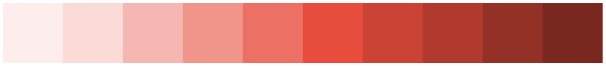
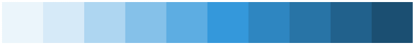
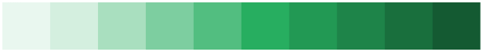
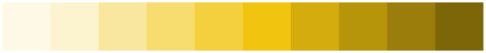
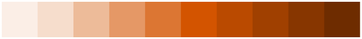

# Map Indicators

Map indicators display indicator data on top of a spatial (geographic) map. Once you create, implement, and publish them, they will be available on the map pages you create and assign them to. Users can select their preferred base map during use.

## Creating Map Indicators

There are two ways to create map indicators: a CLI command and a web form.

### Method 1: CLI Command

Run the `php artisan chimera:make-map-indicator` command and follow the prompts. This works best on Linux/macOS/WSL environments.

### Method 2: Web Form

Navigate to the **Management** menu, select **Map Indicators**, then press the **CREATE NEW** button and fill out the form as required. The included stub is used to create the `MapIndicator` class file in the `app/MapIndicators` directory.

Like regular indicators, map indicators can be organized into different pages. You can assign a map indicator to appear on one or more pages via the edit form.

## Implementing Map Indicators

You need to implement the `getData()` method so that it returns a `Collection`. At minimum, your collection must include these two keys:

- **`area_code`** — Used to match the corresponding area on the map.
- **`value`** — Displayed when you hover over each area on the map.

Additionally, including the following two keys unlocks extra functionality:

- **`display_value`** — Replaces the `value` text shown in the map tooltip.
- **`info`** — Rendered in an information box on the bottom-right of the map when the area is clicked.

If you need to use different column names for these keys, you can override the default values by setting the following public properties on your `MapIndicator` class:

```php
public string $valueField = 'value';
public string $displayValueField = 'display_value';
public string $areaCodeField = 'area_code';
public string $infoTextField = 'info';
```

### Color Bins and Palettes

You should also configure the following properties:

```php
public array $bins = [0, 30, 70, 100];
const SELECTED_COLOR_CHART = 'rag';
```

In the example above, areas on the map will be colored according to the bins you have provided:

- Values below 30 → Red
- Values between 30 and 70 → Amber
- Values above 70 → Green

You have 8 color palettes to choose from. The first 7 palettes each have 10 colors arranged from lightest (lowest values) to darkest (highest values). If you have fewer bins than colors in your selected palette, the system uses as many as needed starting from the lightest. You cannot have more bins than available colors.

### Available Color Palettes

**alizarin**



**wisteria**


**peter-river**



**nephritis**



**sunflower**



**pumpkin**



**silver**


**rag**


You can also modify the built-in color palettes by overriding the given constants in your class.

> **Tip:** The intended use of these palettes is for you to decide on appropriate bins. Even if you have target values to compare against, you should do that in your `getData()` method and return the "ranked" values via the `value` column so that your areas are colored accordingly.

## In the Sandbox

### Total Population

Use these values to create a map indicator that displays the total population of a given area as a percentage of the reference population:

- **Data source:** Kenya Census
- **Name:** `KenyaCensus/TotalPopulation`
- **Title:** Total Population
- **Description:** Total population of households in a given area, shown as a percentage of the reference population.

After creating the map indicator, navigate in your IDE to the `app/MapIndicators/KenyaCensus` directory and open the `TotalPopulation.php` file.

You should see the following code:

```php
<?php

namespace App\MapIndicators\KenyaCensus;

use Uneca\Chimera\MapIndicator\MapIndicatorBaseClass;
use Uneca\Chimera\Services\BreakoutQueryBuilder;

class TotalPopulation extends MapIndicatorBaseClass
{
    // public string $valueField = 'value';
    // public string $displayValueField = 'display_value';
    // public string $infoTextField = 'info';

    // public array $bins = [0, 35, 65, 100];
    // public const SELECTED_COLOR_CHART = 'rag';

    public function getData(string $filterPath): Collection
    {
        return collect();
    }
}
```

Replace the file contents with the following implementation:

```php
<?php

namespace App\MapIndicators\KenyaCensus;

use Illuminate\Support\Collection;
use Uneca\Chimera\MapIndicator\MapIndicatorBaseClass;
use Uneca\Chimera\Services\BreakoutQueryBuilder;

class TotalPopulation extends MapIndicatorBaseClass
{
    // public string $valueField = 'value';
    // public string $displayValueField = 'display_value';
    // public string $infoTextField = 'info';

    public array $bins = [0, 35, 65, 100];
    public const SELECTED_COLOR_CHART = 'rag';

    public function getData(string $filterPath): Collection
    {
        return (new BreakoutQueryBuilder($this->mapIndicator->data_source, $filterPath))
            ->select(['SUM(total_household_members) AS value'])
            ->from(['housing_rec'])
            ->groupBy(['area_code'])
            ->lastlyAreaLeftJoinData(referenceValueToInclude: 'population')
            ->get()
            ->map(function ($r) {
                // Convert the population value to a percentage of the reference value
                $r->value = round(($r->value / $r->ref_value) * 100, 2);
                return $r;
            });
    }
}
```

After implementing the map indicator, publish it and assign it to a map page. You can then navigate to that page to see the choropleth map in action.
