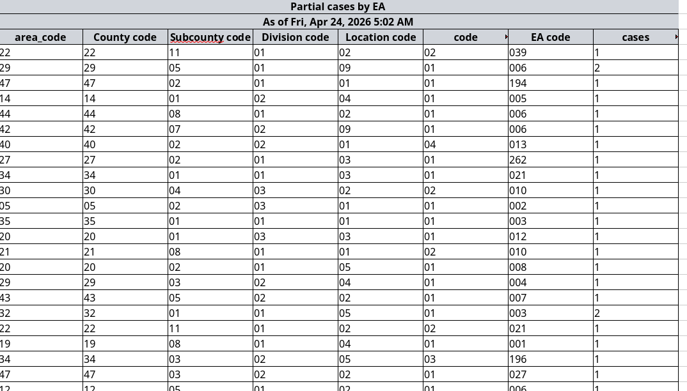

# Reports

Reports are compiled tabular datasets presented as CSV or Excel file formats. They are automatically generated based on a set schedule and can also be automatically emailed to designated users of the dashboard.

Just like indicators, reports can be organized into different pages. You can assign a report to appear on one or more pages. This is achieved during the edit process.

## Creating Reports

There are two ways to create report. A cli command and a web form.

The first way is by running the php artisan chimera:make-report command and following the various prompts. This works best when you are running a linux machine.

The second way is by going to the Manage dashboard menu and selecting Reports, then pressing the CREATE NEW button and filling out the form as directed.

## Implementing Reports
Obviously, you will have to write some code in your generated report file so that it queries and returns the data that needs to be present in the generated report file.

You need to implement the getData() method and make sure it returns a Collection. The keys of the collection will become the column headers of the report spreadsheet and the values will become the rows.

## In the Sandbox
In our training sandbox, we wil be creating a report to demonstrate how they work.

### Partial cases by EA
Use these values to create a report that displays the number of partial cases by EA.
- Data Source: Kenya Census
- Name: KenyaCensus/PartialCasesByEa
- Title: Partial cases by EA
- Description: Total number of partial cases per enumeration area

After you have created the report, navigate, in your IDE, to the `app/Livewire/Reports/KenyaCensus` directory and open the `PartialCasesByEa.php` file.

You should see the following code:
```php
<?php

namespace App\Reports\KenyaCensus;

use Illuminate\Support\Collection;
use Uneca\Chimera\Report\ReportBaseClass;
use Uneca\Chimera\Services\BreakoutQueryBuilder;

class PartialCasesByEa extends ReportBaseClass
{
    public function getData(string $filterPath): Collection
    {
        // TODO: Implement getData() method.
    }
}
```

Where it says `TODO: Implement getData() method.` is where you will have to write the code to query the desired data from the database.

You can use the code below: (remember to include necessary imports)
```php
    return (new BreakoutQueryBuilder($this->report->data_source, $filterPath ))
        ->select([
            "LPAD(county,2,'0') AS 'County code'",
            "LPAD(subcounty,2,'0') AS 'Subcounty code'",
            "LPAD(division,2,'0') AS 'Division code'",
            "LPAD(location,2,'0') AS 'Location code'",
            "LPAD(sublocation,2,'0') AS 'Sublocation code'",
            "LPAD(ea,3,'0') AS 'EA code'",
            "SUM(CASE WHEN cases.partial_save_mode IS NULL THEN 0 ELSE 1 END) AS 'No. of partial cases'"
        ])
        ->from([])
        ->groupBy([
            'CONCAT(county, subcounty, division, location, sublocation, ea)'
        ])
        ->having(['`No. of partial cases` > 0'])
        ->get();
```

What you have just accomplished is for your new report to be able to return the necessary data from the database. The next step is to enable and configure the report so that it can be run at a scheduled time and at the desired frequency.

For this, navigate to the report management page and click on the 'Edit' button and you will be able to publish, enable and schedule the report. The `Run now` button will allow you to run/generate the report immediately so that you do not have to wait for the scheduled time.

