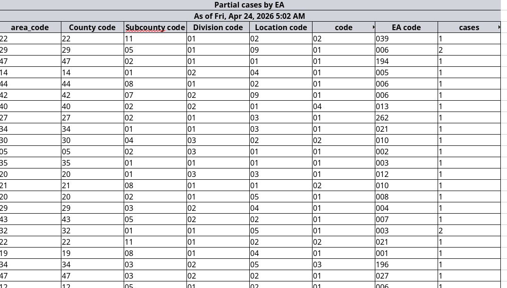

# Reports

Reports are compiled tabular datasets presented as CSV or Excel files. They can be generated on demand or automatically on a set schedule, and can also be emailed automatically to designated dashboard users.

Like indicators, reports can be organized into different pages. You can assign a report to appear on one or more pages via the edit form.

## Creating Reports

There are two ways to create reports: a CLI command and a web form.

### Method 1: CLI Command

Run the `php artisan chimera:make-report` command and follow the prompts. This works best on Linux/macOS/WSL environments.

### Method 2: Web Form

Navigate to the **Management** menu, select **Reports**, then press the **CREATE NEW** button and fill out the form as directed.

## Implementing Reports

You need to implement the `getData()` method so that it returns a `Collection`. The keys of the collection items will become the column headers of the report spreadsheet, and the values will become the rows.

## In the Sandbox

In our training sandbox, we will be creating a report to demonstrate how reports work.

### Partial Cases by EA

Use these values to create a report that displays the number of partial (incomplete) cases per enumeration area:

- **Data Source:** Kenya Census
- **Name:** `KenyaCensus/PartialCasesByEa`
- **Title:** Partial cases by EA
- **Description:** Total number of partial (incomplete) cases per enumeration area.

After creating the report, navigate in your IDE to the `app/Reports/KenyaCensus` directory and open the `PartialCasesByEa.php` file.

You should see the following code:

```php
<?php

namespace App\Reports\KenyaCensus;

use Illuminate\Support\Collection;
use Uneca\Chimera\Report\ReportBaseClass;
use Uneca\Chimera\Services\BreakoutQueryBuilder;

class PartialCasesByEa extends ReportBaseClass
{
    public function getData(string $filterPath): Collection
    {
        // TODO: Implement getData() method.
    }
}
```

Replace the `// TODO` section with the following code (remember to include necessary imports):

```php
return (new BreakoutQueryBuilder($this->report->data_source, $filterPath))
    ->select([
        "LPAD(county,2,'0') AS 'County code'",
        "LPAD(subcounty,2,'0') AS 'Subcounty code'",
        "LPAD(division,2,'0') AS 'Division code'",
        "LPAD(location,2,'0') AS 'Location code'",
        "LPAD(sublocation,2,'0') AS 'Sublocation code'",
        "LPAD(ea,3,'0') AS 'EA code'",
        "SUM(CASE WHEN cases.partial_save_mode IS NULL THEN 0 ELSE 1 END) AS 'No. of partial cases'"
    ])
    ->from([])
    ->groupBy([
        'CONCAT(county, subcounty, division, location, sublocation, ea)'
    ])
    ->having(['`No. of partial cases` > 0'])
    ->get();
```

This query returns all EAs that have at least one partial (incomplete) case, along with their hierarchical area codes.

### Publishing and Scheduling

After implementing the report, navigate to the report management page and click the **Edit** button. From there you can:

- **Publish** the report to make it visible on assigned pages.
- **Enable** the report to allow scheduled generation.
- **Schedule** the report to run at a specific time and frequency.
- Use the **Run now** button to generate the report immediately without waiting for the scheduled time.


