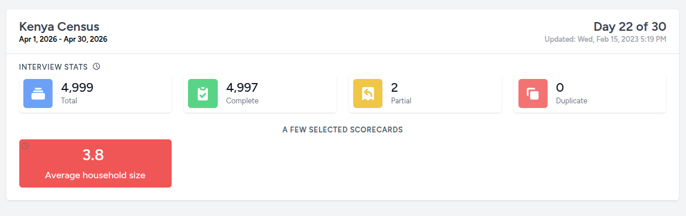

# Scorecards
Scorecards are meant to display very high-level data that pertains to either an important indicator or a performance metric. They are helpful to management in decision making and problem solving.

## Creating scorecards
There are two ways to create scorecards. A cli command and a web form.

The first way is by running the `php artisan chimera:make-scorecard` command and following the various prompts. This works best when you are running a linux machine.

The second way is by going to the Manage dashboard menu and selecting Scorecards, then pressing the CREATE NEW button and filling out the form as required.

Scorecards usually display just two things: title and value but can also include a delta display (to show percentage of change from a reference value) and a link button to jump to an indicator, if it exists.

## Implementing scorecards
Obviously, you will have to write some code in your generated scorecard file so that it distills and returns a value you intend.

You have a high degree of freedom on how you choose to code your scorecard as long as, at the end, you set the appropriate public class properties with their desired values. You have to return a Laravel Collection from the getData public method containing two elements. The first one being the value to display and the second being the change in value (delta) compared to some reference. If you do not intend to use the delta, you can return null. The last line of your getData() method could look like the following:

```php
return collect([$displayValue, $delta]);
```

- $this->title

  title is by default inherited from what you had provided when you created the scorecard. You can also edit this from the management menu.

- $this->bgColor

  the scorecard background color is dictated by the currently chosen theme but you are free to override and set your own desired color using HTML color constants or hex color values.

- $this->diff

  by default, this is set to 0 but you can set it to any integer (signed) value to depict the delta between the main value and some reference value.

- $this->unit

  by default, this is set to % and is shown as a unit for your delta (diff). You can override it to be any other unit or you can also set it to be an empty string.

- $this->value

  by default, this is set to the string value 'NA' but you are expected to set it to the value you want displayed on the scorecard. You will probably have to run some database queries to calculate that value.

## Exercise Scorecards
In our training sandbox, we wil be creating two scorecards to demonstrate how they work. These will be based on the included Kenya Census database. Please follow the instructions below to create and experience them.

### Average household size
Use these values to create a scorecard that displays the average household size of a given area.
- Data source: Kenya Census
- Scorecard name: KenyaCensus/AverageHouseholdSize
- Title: Average household size

After you have created the scorecard, navigate, in your IDE, to the `app/Livewire/Scorecard/KenyaCensus` directory and open the `AverageHouseholdSize.php` file.

You should see the following code:
```php
<?php

namespace App\Livewire\Scorecard\KenyaCensus;

use Illuminate\Support\Collection;
use Uneca\Chimera\Livewire\ScorecardComponent;
use Uneca\Chimera\Services\BreakoutQueryBuilder;

class AverageHouseholdSize extends ScorecardComponent
{
    // public string $unit = '%';
    // public string $bgColor;
    // public string $fgColor;

    public function getData(string $filterPath): Collection
    {
        try {
            // TODO: Implement getData() method.
        } catch (\Exception $exception) {
            return collect();
        }
    }
}
```

Where it says `TODO: Implement getData() method.` is where you will have to write the code to calculate the average household size.

You can use the code below:
```php
    $result = (new BreakoutQueryBuilder($this->scorecard->data_source, $filterPath))
        ->select(['SUM(total_household_members) AS total_population', 'COUNT(*) AS total_households'])
        ->from(['housing_rec'])
        ->get()
        ->first();
    return collect([Number::format(safeDivide($result->total_population, $result->total_households), 1), null]);
```

Once you have completed editing the code, you can go to the Scorecard management interface, edit the scorecard and publish it.

What remains is to then visit the home page and see the scorecard in action, under the "Kenya Census" summary card. You should see something like this:



### Total Households
Use these values to create a scorecard that displays the total number of households in a given area.
- Data source: Kenya Census
- Scorecard name: KenyaCensus/TotalHouseholds
- Title: Total households

Here is one possible implementation:
```php
    $result = (new BreakoutQueryBuilder($this->scorecard->data_source, $filterPath))
        ->select(['COUNT(*) AS total'])
        ->from(['housing_rec'])
        ->get()
        ->first();
    return collect([Number::format($result->total), null]);
```
