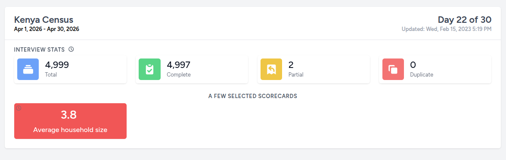

# Scorecards

Scorecards display high-level data that pertains to an important indicator or performance metric. They are helpful for management in decision-making and problem-solving, providing quick numeric summaries at a glance.

## Creating Scorecards

There are two ways to create scorecards: a CLI command and a web form.

### Method 1: CLI Command

Run the `php artisan chimera:make-scorecard` command and follow the prompts. This works best on Linux/macOS/WSL environments.

### Method 2: Web Form

Navigate to the **Management** menu, select **Scorecards**, then press the **CREATE NEW** button and fill out the form as required.

Scorecards usually display two things: a **title** and a **value**. They can also include a delta display (showing percentage change from a reference value) and a link button to jump to a related indicator.

## Implementing Scorecards

You will need to write code in your generated scorecard file so that it calculates and returns the value you intend.

You have a high degree of freedom in how you code your scorecard, as long as you set the appropriate public class properties. The `getData()` method must return a Laravel `Collection` containing two elements:

1. The **value** to display.
2. The **change in value (delta)** compared to some reference. If you do not intend to use the delta, return `null`.

The last line of your `getData()` method could look like this:

```php
return collect([$displayValue, $delta]);
```

### Available Properties

- **`$this->title`** — Inherited from what you provided when creating the scorecard. You can also edit it from the management menu.
- **`$this->bgColor`** — The scorecard background color is dictated by the current theme, but you can override it using HTML color names or hex values.
- **`$this->diff`** — By default set to `0`. Set it to any signed integer to depict the delta between the main value and a reference value.
- **`$this->unit`** — By default set to `%` and shown as the unit for your delta. You can override it to any other unit or set it to an empty string.
- **`$this->value`** — By default set to `NA`. You are expected to set it to the value you want displayed. You will likely need to run database queries to calculate this value.

## In the Sandbox

In our training sandbox, we will be creating two scorecards to demonstrate how they work. These will be based on the included Kenya Census database.

### Scorecard 1: Average Household Size

Use these values to create a scorecard that displays the average household size for a given area:

- **Data source:** Kenya Census
- **Scorecard name:** `KenyaCensus/AverageHouseholdSize`
- **Title:** Average household size

After creating the scorecard, navigate in your IDE to the `app/Livewire/Scorecard/KenyaCensus` directory and open the `AverageHouseholdSize.php` file.

You should see the following code:

```php
<?php

namespace App\Livewire\Scorecard\KenyaCensus;

use Illuminate\Support\Collection;
use Uneca\Chimera\Livewire\ScorecardComponent;
use Uneca\Chimera\Services\BreakoutQueryBuilder;

class AverageHouseholdSize extends ScorecardComponent
{
    // public string $unit = '%';
    // public string $bgColor;
    // public string $fgColor;

    public function getData(string $filterPath): Collection
    {
        try {
            // TODO: Implement getData() method.
        } catch (\Exception $exception) {
            return collect();
        }
    }
}
```

Replace the `// TODO` section with the following code:

```php
$result = (new BreakoutQueryBuilder($this->scorecard->data_source, $filterPath))
    ->select(['SUM(total_household_members) AS total_population', 'COUNT(*) AS total_households'])
    ->from(['housing_rec'])
    ->get()
    ->first();
return collect([Number::format(safeDivide($result->total_population, $result->total_households), 1), null]);
```

To format the value nicely, we use the `Number` helper class. Import it at the top of the file:

```php
use Illuminate\Support\Number;
```

Once you have completed the implementation, go to the Scorecard management interface, edit the scorecard, and publish it.

Visit the home page to see the scorecard in action under the "Kenya Census" summary card. You should see something like this:



### Scorecard 2: Total Households

Use these values to create a scorecard that displays the total number of households for a given area:

- **Data source:** Kenya Census
- **Scorecard name:** `KenyaCensus/TotalHouseholds`
- **Title:** Total households

Here is one possible implementation:

```php
$result = (new BreakoutQueryBuilder($this->scorecard->data_source, $filterPath))
    ->select(['COUNT(*) AS total'])
    ->from(['housing_rec'])
    ->get()
    ->first();
return collect([Number::format($result->total), null]);
```
