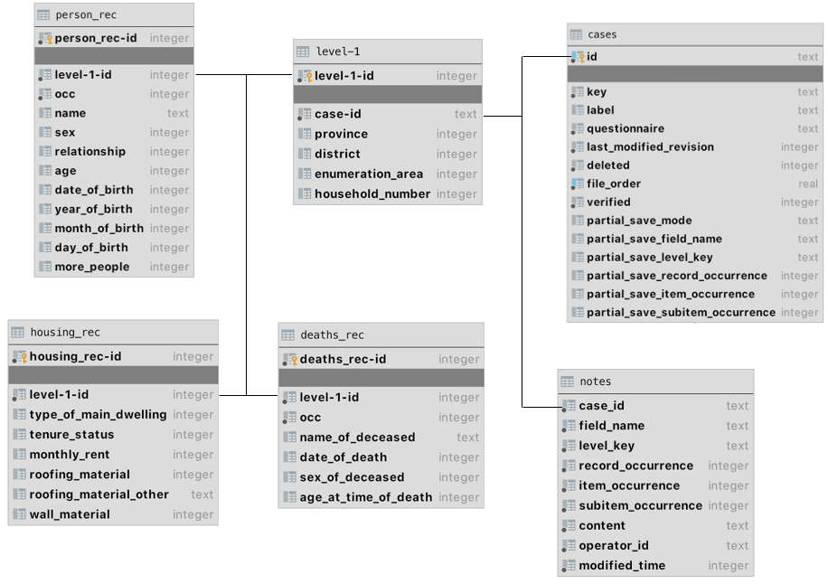

# Understanding CSPro Data
In CSPro, the **Breakout Database** (Relational format) is a schema where the hierarchical survey data is "broken out" into standard relational tables.

Since CSPro data is inherently hierarchical (e.g., one Household contains many Persons), the breakout schema uses a specific set of rules to map those hierarchies into a SQL-friendly structure.

### 1. The Table Structure
The schema is determined by your **Data Dictionary (.dcf)**. Each level of the hierarchy and each record type becomes its own table.

| Table Category | Description | Name Convention |
| :--- | :--- | :--- |
| **Cases Table** | The root table containing metadata for every case (questionnaire). | `cases` |
| **Level Table** | Stores ID items (Province, District, HH Number). | `level-1`, `level-2`, etc. |
| **Record Tables** | Contains the actual data for each record type (e.g., Housing, Population). | Same as the Record name in the Dictionary. |
| **Notes Table** | Stores field notes or comments entered during data collection. | `notes` |

---

### 2. Primary Keys and Linking
To keep the data related across tables, CSPro uses internal IDs.
* **`case-id` (UUID):** Every questionnaire has a unique string ID (UUID) in the `cases` table. This links the `cases` table to the `level-1` table.
* **`level-1-id`:** This is an integer primary key generated in the `level-1` table. **All** record tables (like `PERSON_REC`) use this column as a foreign key to link back to their parent case.
* **`occ` (Occurrence):** For records that repeat (like multiple people in one house), an `occ` column is added to the record table. It acts like a row index (1, 2, 3...) within that specific case.


---

### 3. Data Type Mapping
When CSPro "breaks out" the data into SQLite or exports it to MySQL/SQL Server, it maps dictionary types to SQL types:

* **Numeric Items:** Usually mapped to `INTEGER` or `REAL` (if they have decimal places).
* **Alpha Items:** Mapped to `TEXT` or `VARCHAR`.
* **Multiple Response:** These are typically stored as a single string (concatenated codes), though some export tools can split them into individual boolean columns.

---

### 4. Example SQL Join
If you want to view a list of all people along with their Household IDs, you would perform a join:

```sql
SELECT 
    L.province, L.district, L.hh_number, 
    P.name, P.age, P.sex
FROM person_rec P
JOIN `level-1` L ON P.`level-1-id` = L.`level-1-id`
JOIN cases C ON L.`case-id` = C.id
WHERE C.deleted = 0; -- Filters out "soft-deleted" cases
```

> **Note:** CSPro uses a "soft delete" system. When a case is deleted in the software, it isn't immediately dropped from the database; the `deleted` flag in the `cases` table is simply set to `1`. Always filter for `deleted = 0` in your queries.


