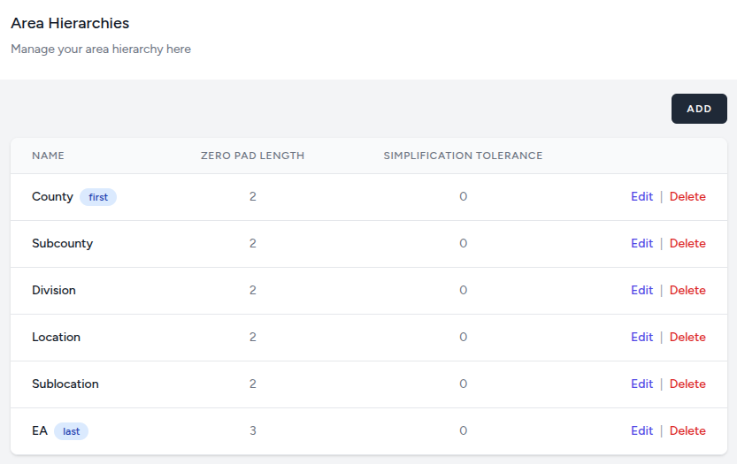

# Area Hierarchy

An **Area Hierarchy** represents the structured system of administrative divisions—such as regions, provinces, and districts—used to organize geographical data during a census or survey. These divisions serve as the backbone for data collection, resource allocation, and localized governance.

## Understanding Area Hierarchies

### Governance and Standardization
While administrative boundaries are typically defined by a specific branch of government (such as a Ministry of Interior), **National Statistical Offices (NSOs)** often refine these boundaries. They may adopt official lines as-is or create specialized "statistical units" to ensure each area meets specific population thresholds or geographic criteria necessary for accurate data analysis.

### Common Tiers of Administrative Units
Administrative structures vary significantly by country, but they generally follow a nested "top-down" approach. Below are the common designations for these levels:

* **Primary Level (Largest):** Often referred to as "ADM1," these are the principal subdivisions of a nation. Common names include **states**, **provinces**, **oblasts**, **governorates**, **cantons**, **prefectures**, and **emirates**.
* **Secondary Level (Intermediate):** These units break down primary divisions into manageable sections, such as **counties**, **districts**, **raions**, **județe**, or **circuits**.
* **Tertiary Level (Smallest):** The most granular level used for local administration, often consisting of **municipalities**, **communes**, **wards**, or **communities**.

### The Nested Structure
The defining characteristic of an area hierarchy is that it is **exclusive and exhaustive**: every small unit must fit perfectly into exactly one larger unit, and the sum of all units at any level must cover the entire territory of the country.

| Level | Global Examples | Purpose |
| :--- | :--- | :--- |
| **National** | Country, Sovereign State | Macro-analysis and national policy. |
| **Regional (ADM1)** | State (US), Province (Canada), Canton (Switzerland) | Regional planning and legislative districts. |
| **Local (ADM2/3)** | Municipality, Parish, Village | Service delivery and granular data collection. |

### Enumeration Areas (EAs): The Foundation of Data Collection

While administrative hierarchies (like provinces and districts) are designed for governance, **Enumeration Areas (EAs)** are designed specifically for the logistics of data collection. An EA is the smallest geographic unit defined by an NSO for a census or survey, representing the specific area assigned to a single enumerator.

Unlike political boundaries, EAs are purely functional and are created based on **workload capacity** rather than historical or legal lines.

#### Key Characteristics of EAs
* **Population Stability:** EAs are usually delineated so that they contain a roughly equal number of households or people (e.g., 150 to 200 households), ensuring that one person can complete all interviews within the allotted census period.
* **Mutual Exclusivity:** EAs must not overlap, and their boundaries must be easily identifiable on the ground (using features like roads, rivers, or railways) to prevent double-counting or skipping households.
* **Nesting:** Critically, EAs must nest perfectly within the higher administrative levels. This ensures that data collected at the "street level" can be aggregated accurately up to the District, Province, and National levels.

> **Note:** In urban environments, an EA might be a single high-rise apartment building or a few city blocks. In rural areas, a single EA could encompass several square kilometers and multiple small villages.

#### Administrative Units vs. EAs

| Feature | Administrative Units (Districts/Provinces) | Enumeration Areas (EAs) |
| :--- | :--- | :--- |
| **Primary Goal** | Governance, Law, and Budgeting | Data Collection and Sampling |
| **Defined By** | Legislation or Executive Decree | National Statistical Office (NSO) |
| **Size Criteria** | Historical/Political boundaries | Population density and "Enumerability" |
| **Permanence** | Relatively permanent | Often redrawn every 10 years for new censuses |

## In the Sandbox

To view or add area hierarchies, go to the 'Area Hierarchy' menu item under the management dropdown menu.

You should see an 'Add' button as long as you are in [developer mode](/advanced-topics/developer-mode), otherwise, you will only see a list of area hierarchies you have already added or an empty table.

(You need to have developer mode enabled to be able to create your area hierarchy. If developer mode is not enabled, you will not see the 'Add' button.)

Please note that the order of appearance of the area entries is important. It signifies hierarchy (top down).

### Creating our Area Hierarchy

In this training, we will be using sample data from the Kenya 2019 Census. Therefore, we will be using the following area hierarchy that was used by KNBS during the census:
* **Country**
* **Subcounty**
* **Division**
* **Location**
* **Sublocation**
* **EA**

### Zero Pad Length
Later on, we will be importing the areas for each of the above hierarchies. Those areas will usually have an identifying name and code. The codes for areas of any given level will be of equal length. 

When adding the hierarchy, you will notice that you can specify the size to which the system should zero-pad the codes.
For example, if you say Subcounties should be zero-padded to 2 digits, then a code of 5 will be stored as 05 and a code of 12 will be stored as 12 as it is already of length two. This is very important as the codes are what are used to match the data with their appropriate hierarchies (levels).

The setting you provide here is dictated by how the data is being stored by your CAPI app. When actual data starts coming through during the census, each interview will carry these codes and the dashboard will use them to match the data with the appropriate hierarchy (area).

### Shape Simplification Tolerance

In the world of GIS (Geographic Information Systems), shape simplification is the process of reducing the number of vertices in a polyline or polygon while attempting to retain its essential shape.

The tolerance is the magic number that dictates exactly how aggressive that reduction will be.

**How Tolerance Works**
Think of tolerance as a "corridor" or a "buffer zone" around a line. It represents the maximum distance a simplified line can deviate from the original geometry.

- *Low Tolerance:* The simplified line must stay very close to the original path. Fewer points are removed, and the shape remains highly detailed.

- *High Tolerance:* The simplified line can stray further from the original path. Many points are removed, resulting in a "blockier" or smoother look.

As this is one of the values you will be setting for each hierarchy, it is important to understand how it affects the shape of the areas. This value will be used when importing the areas from a shapefile. 

**Why Use It?**
Simplifying shapefiles isn't just about making them look different; it’s usually a practical necessity:

- *Performance:* Large shapefiles with millions of vertices can crawl in a browser or mobile app. Fewer points = faster rendering.

- *Storage:* Reducing vertices slashes file size, which is critical for web mapping (e.g., GeoJSON or TopoJSON exports).

**The Risks of High Tolerance**
While simplification is useful, setting the tolerance too high can lead to data integrity issues. If you oversimplify a given area, subsequent (child) areas might not be able to self-locate properly and will therefore break the hierarchy during the import process.

The value should be somewhere between 0 and 1, with 1 being the most aggressive and 0 meaning no simplification at all.

Now, go ahead and create the area hierarchies starting with Country and ending with EA.

You can use the values from the table above to create your hierarchy. We will be setting the simplification tolerance to 0 because for the purposes of this training, we do not need to simplify the areas.
