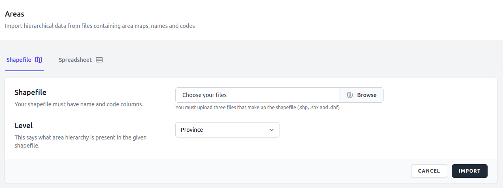
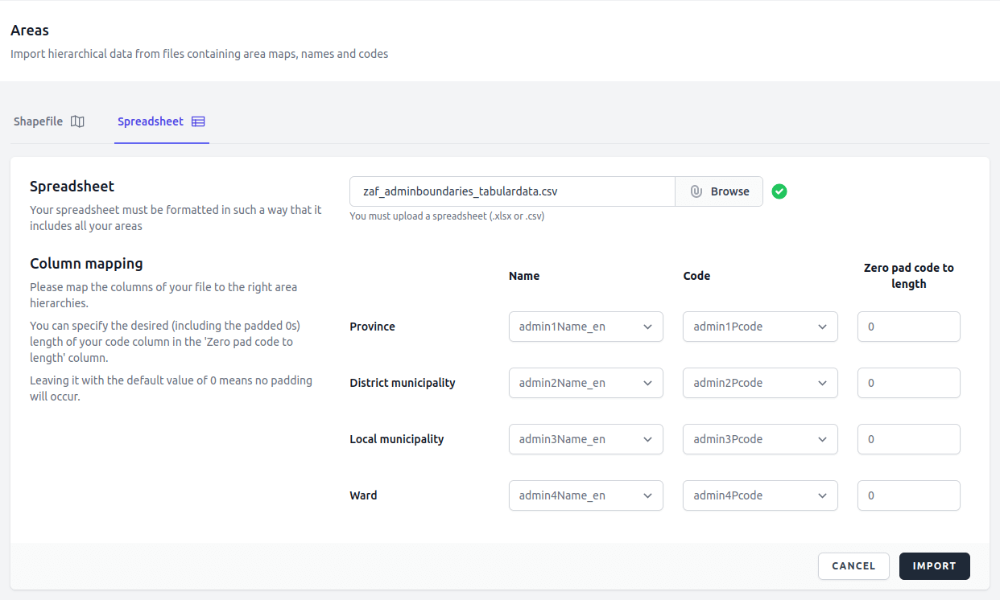
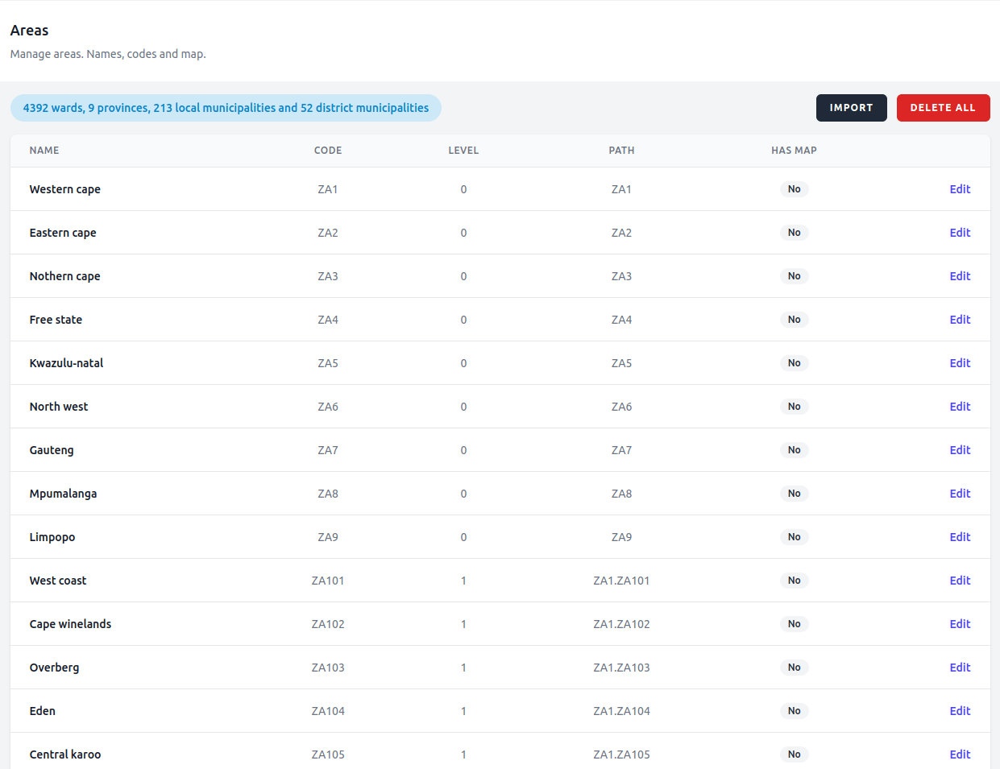

# Areas

To visualize data correctly, the dashboard needs to know your administrative boundaries. The *Areas* interface provides a comprehensive directory for managing every geographic unit across all levels of the defined hierarchy. This is where names, codes, and map availability are displayed.

## Importing Areas
The Import interface allows administrators to upload hierarchical area data containing area maps, names, and codes. Users can toggle between two specialized upload methods depending on the data format.

You have the option of importing the areas from two file formats:

### Shapefiles (preferred)

  Shapefile (.shp, .shx, and .dbf) is the preferred file format for importing areas into your dashboard because it contains both the spatial data and the area metadata (names and codes).

  When importing the various levels via shapefiles, the dashboard will take care of associating them with each other (creates the parent-child relationship) by matching them **spatially**. Therefore, it is important to make sure that all your shapefiles are consistent and that they are **spatially** contained by one another. Order of importation is also important as parent (containing) areas need to be improted before child (contained) areas.

  The algorithm has a threshold of about 70% minimum containment that it uses to pair parent-child areas. If you choose to "simplify" you shapefiles, make sure that you do not over do it. You can overlay them to check that lower levels are still contained (at least 70%) by their immediate higher level area.

  

> [!WARNING]
> Please make sure that the shapefile you are attempting to import has the EPSG:4326 - WGS 84 Coordinate Reference System (CRS).

### Spreadsheets (.csv)

  You can also import your areas via a csv file but here you will not have the maps and therefore can not have map based indicators in you dashboard as csv format will only contain the area names and codes.

  When importing, you can use the interface to map which columns of your spreadsheet hold which area level (name and code) and are also able to apply zero padding to your codes to match how they appear in your source data (questionnaire).

  

  The imported data should look something like the following

  

> The example spreadsheet data for South Africa, seen above, was sourced from [The Humanitarian Data Exchange](https://data.humdata.org/)

When the process has completed, you will receive a notification. If the importation was successful, you will find the path column formula in the notification message, which you can use on the same spreadsheet file to
generate a new "path" column which will be used to uniquely identify the areas and which is also required when you import reference values.

> [!IMPORTANT]
> You must make sure that your area codes in the csv or shapefiles match your codes from the database. If they need zero padding, the csv importer can help you with that, but you will have to apply the zero-padding to the shapefiles yourself. If they also need concatenation, make sure you take care of that before attempting to import them.

> [!IMPORTANT]
> When trying to import a file, if you get an error message stating that the file must not be of size greater than 12MB, then you can override this default file size limit in the livewire.php config file. Just follow the instructions in the Laravel Livewire documentation [here](https://livewire.laravel.com/docs/uploads#global-validation)

## In the Sandbox

In the training sandbox repository, under the "training" directory, you will find various resources that we are going to be using in this training. You can find shapefiles and csv files for the areas in the "Areas" directory.

As there are thousands of areas in the csv file, it will require sometime to complete. Once complete, you will receive a notification with the results.

Now, carefully follow the instructions given above and import the areas from the csv file (./training/Areas/areas.csv).

Once you have managed this successfully, you can use the "DELETE ALL" button and then import the shapefiles (./training/Areas/areas.csv). This is so you can exercise both methods of importing areas.

> [!INFO]
In case you have already imported your areas (EA Frame) via a csv file, you can then also import your shapefile to augment them with spatial data. Make sure the codes in the shapefiles match the ones you have already imported in the csv file, otherwise you will cause duplicate areas to exist in your database.
