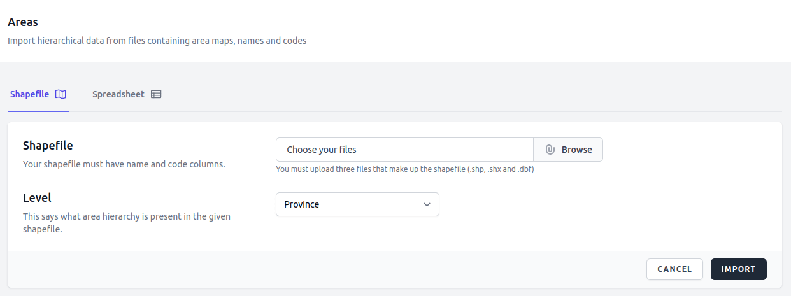
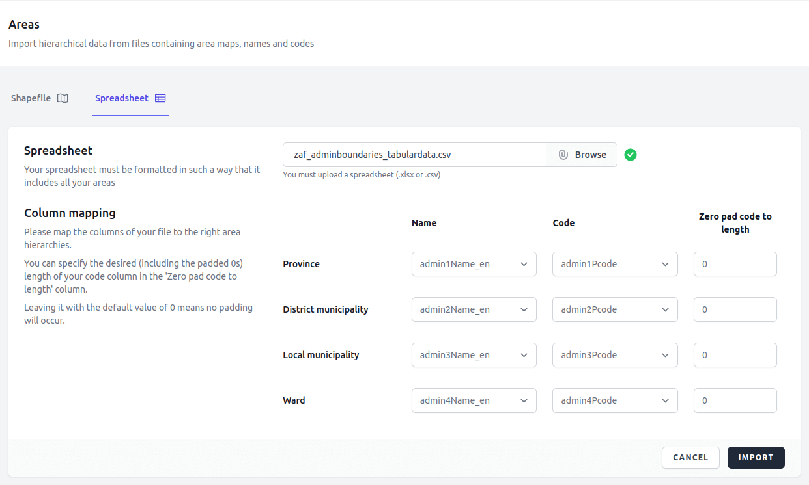
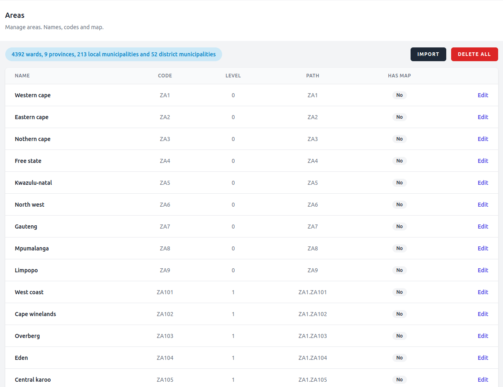

# Areas

To visualize data correctly, the dashboard needs to know your administrative boundaries. The **Areas** interface provides a comprehensive directory for managing every geographic unit across all levels of the defined hierarchy. This is where names, codes, and map shapes are managed.

## Importing Areas

The Import interface allows administrators to upload hierarchical area data containing area maps, names, and codes. You can toggle between two specialized upload methods depending on your data format.

### Shapefiles (Preferred)

Shapefiles (`.shp`, `.shx`, and `.dbf`) are the preferred format for importing areas because they contain both the spatial data (map boundaries) and the area metadata (names and codes).

When importing areas via shapefiles, the dashboard automatically creates parent-child relationships by matching areas **spatially**. Therefore, it is important to ensure that:

- All your shapefiles are consistent in their coordinate system.
- Child areas are spatially contained within their parent areas.
- You import in order: parent (containing) areas before child (contained) areas.

The algorithm uses a threshold of approximately **70% minimum containment** to pair parent-child areas. If you choose to "simplify" your shapefiles, make sure you do not oversimplify them. You can overlay them to verify that lower-level areas are still contained (at least 70%) by their immediate parent level.

> [!WARNING]
> Make sure that the shapefile you are importing uses the **EPSG:4326 - WGS 84** Coordinate Reference System (CRS).

### Spreadsheets (.csv)

You can also import areas via a CSV file. However, CSV files only contain area names and codes — they do not include spatial data, so you will not be able to use map-based indicators unless you later import shapefiles.

During CSV import, you can use the interface to map which columns of your spreadsheet correspond to each area level (name and code). You can also apply zero padding to your codes to match how they appear in your source data (questionnaire).

The imported data should look something like the following:

> The example spreadsheet data shown above was sourced from [The Humanitarian Data Exchange](https://data.humdata.org/).

After the import process completes, you will receive a notification. If the import was successful, the notification will include a **path column formula**. You can use this formula in your spreadsheet to generate a new "path" column, which uniquely identifies each area and is required when importing reference values.

> [!IMPORTANT]
> You must ensure that your area codes in the CSV or shapefiles match the codes from your database. If they need zero padding, the CSV importer can handle that for you, but you will need to apply zero-padding to shapefiles yourself before importing. If codes also need concatenation, handle that before attempting to import.

> [!IMPORTANT]
> If you receive an error stating that the file must not exceed 12MB, you can override this default limit in the `livewire.php` config file. Follow the instructions in the [Laravel Livewire documentation](https://livewire.laravel.com/docs/uploads#global-validation).

## In the Sandbox

In the training sandbox repository, under the `training` directory, you will find various resources including shapefiles and CSV files for the areas in the `Areas` directory.

### Exercise

1. **Import from CSV:** Import the areas from the CSV file located at `./training/Areas/areas.csv`. Since there are thousands of areas, this will take some time to complete. Once finished, you will receive a notification with the results.

2. **Import from Shapefiles:** After successfully importing from CSV, use the **DELETE ALL** button to clear the imported areas, then import the shapefiles from `./training/Areas/Shapefiles`. This allows you to practice both import methods.

> [!INFO]
> If you have already imported your areas (EA Frame) via a CSV file, you can also import your shapefiles afterward to augment them with spatial data. Make sure the codes in the shapefiles match the ones you already imported from the CSV, otherwise you will create duplicate areas in your database.
