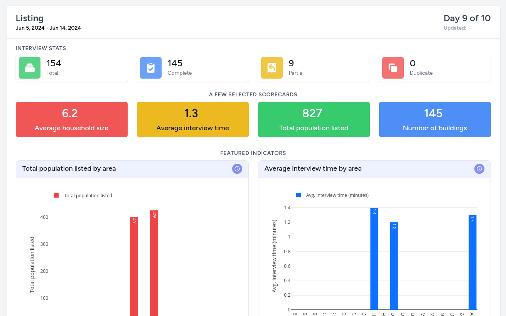
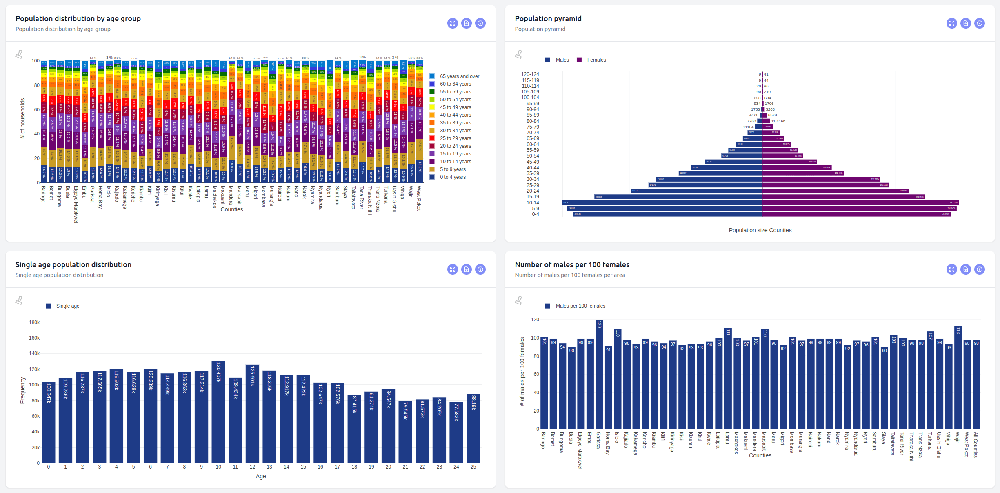
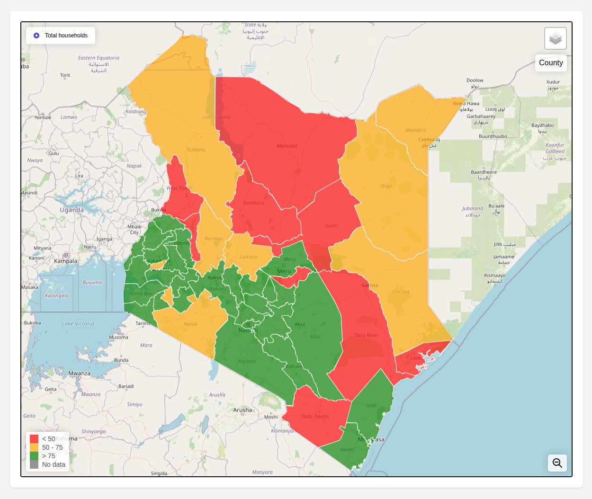
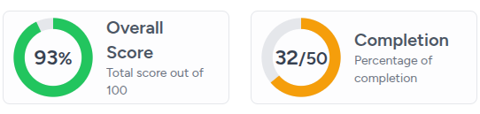
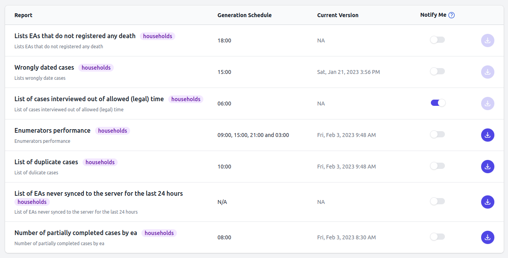
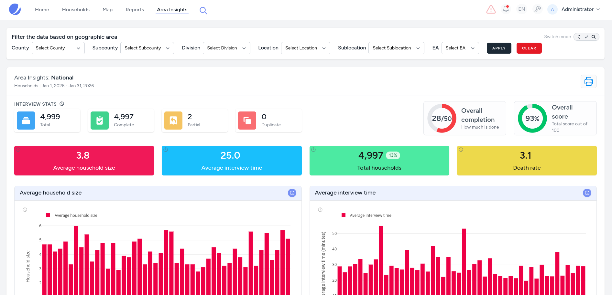

# Dashboard Artefacts

The dashboard is composed of several different artefacts, each with a unique purpose and use case. These artefacts are displayed on various pages throughout the dashboard. Below, we describe each artefact type and explain how it is used.

## Summary Cards

Summary cards display high-level statistics about a data source or field data collection exercise (census/survey). They appear on the home page and show key metrics such as the total number of interviews collected, exercise start and end dates, and completion rates.

Each summary card can also contain:

- **Scorecards** — Displaying specific stats from within the data itself.
- **Featured Indicators** — Regular indicators that have been selected for prominence because of their importance.

You can have multiple summary cards on the home page, one for each data source.

## Indicators

Indicators are data elements that represent statistical information for a specified time, place, and other characteristics. They are typically displayed as interactive charts — such as bar charts, line charts, pie charts, and others — powered by Plotly.js.

Each indicator includes metadata such as a title, a brief description, and extended contextual help text to aid users in understanding the visualization.

## Map Indicators

Map indicators are geographic visualizations of indicator data displayed on top of spatial maps. Values are shown by hovering over each area boundary, and the boundary fill color indicates the data bin into which the value falls. A legend provides clarity for the color-coded bins.

## Gauges

A gauge is a simple visual representation of a single value contrasted against a reference or expected value. Gauges are useful for representing progress towards a goal, such as data collection targets or completion percentages. Color thresholds provide immediate visual feedback on whether a value is below, approaching, or exceeding its target.

## Reports

Reports are compiled tabular datasets presented as Excel or CSV files. They can be generated on demand or automatically on a set schedule, and can also be emailed automatically to designated dashboard users.

## Area Insights

The Area Insights page is a dynamic, powerful tool designed to provide a comprehensive yet high-level snapshot of field operations and thematic indicators for any geographic area. It translates complex datasets into actionable intelligence through a combination of grading gauges, scorecards, and interactive visualizations.

Use the filter bar to narrow data from a national overview down to specific areas — even individual EAs. The filter bar supports both drill-down (cascading dropdowns) and direct search-and-set modes, which stay in sync.

