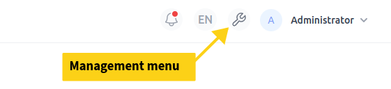
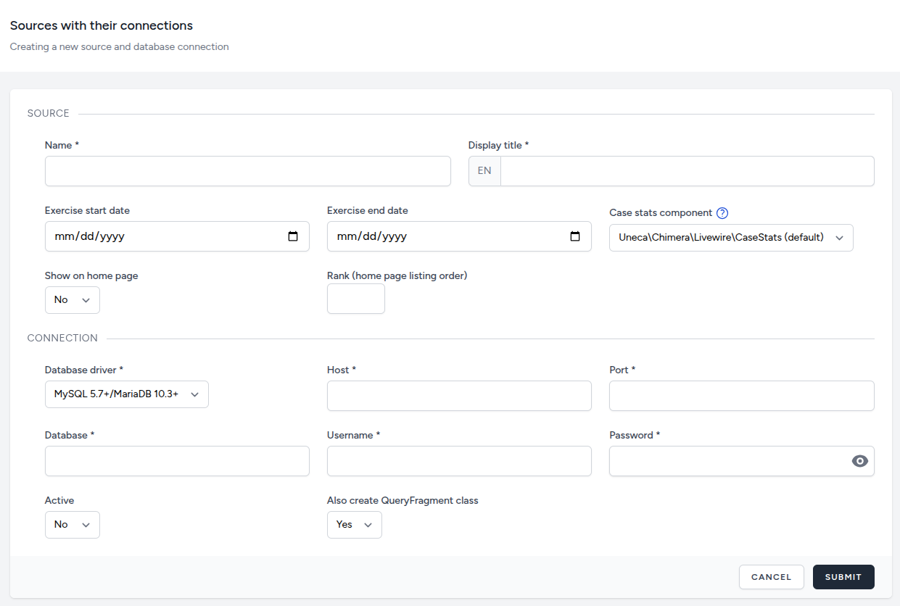
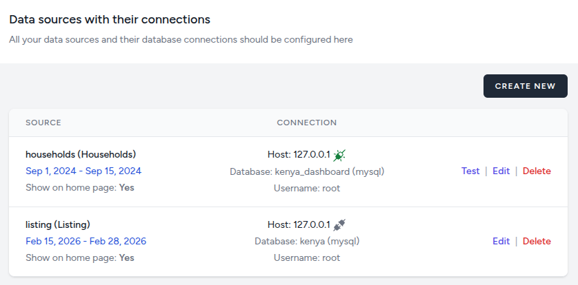

# Data Sources

Your dashboard can connect to and work with multiple data sources (databases) and you do not need to be using CSPro for your census/survey. Our dashboard works with any kind of data in any kind of database as long as Laravel has a driver for it.

Out-of-the-box, we support MySQL, MariaDB, Microsoft SQL, PostgreSQL and SQLite databases as data sources.

As you should already be logged in using a 'Manager/Super Admin' type account, you can directly head to the 'Management' menu (see screenshot below) in your dashboard and start adding data sources. You should also have developer mode enabled, otherwise you will not be able to add data sources.

To create a data source, you need to provide two sets of information. The first one deals with the census/survey exercise and the second one pertains to the database where the respective data is stored.

On the main data sources page, you can manage existing data sources. Meaning that you can edit, test or delete a source.

The Test feature allows you to verify that the connection to the database is working correctly.

## Adding your data source in the sandbox
The training sandbox comes complete with a data source that we will be using throughout this course. It is a MySQL database containing about 5000 cases of anonymized data from the Kenya Census conducted in 2019.

For the first part (source) of the add data source form, please use the following values:
- Name: kenya-census
- Display Title: Kenya Census
- Exercise Start Date: Set to the start of the current month
- Exercise End Date: Set to the end of the current month
- Case stats component: lease as is
- Show on home page: Yes
- Rank: you can lease this empty

For the second part (connection), the following are the default values that have been set in your .env file. You can open the .env file located in the root of your project verify these values. If you have modified them during the setup process, make sure you use the updated values.
- Host: mysql
- Port: 3306
- Database: kenya_census
- Username: sail
- Password: password
- Active: Yes
- Also create QueryFragment class: Yes

Once you have created the data source, use the 'Test' button to verify that the connection is working correctly.
