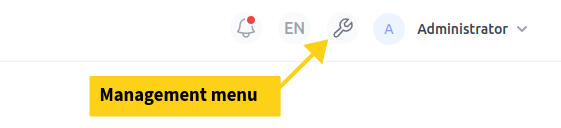
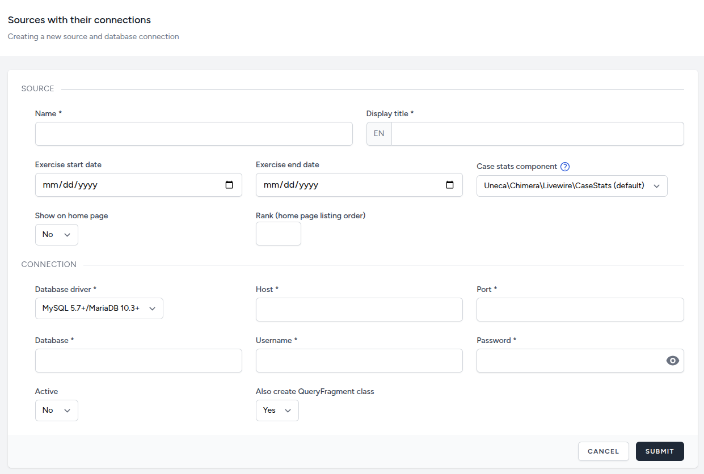
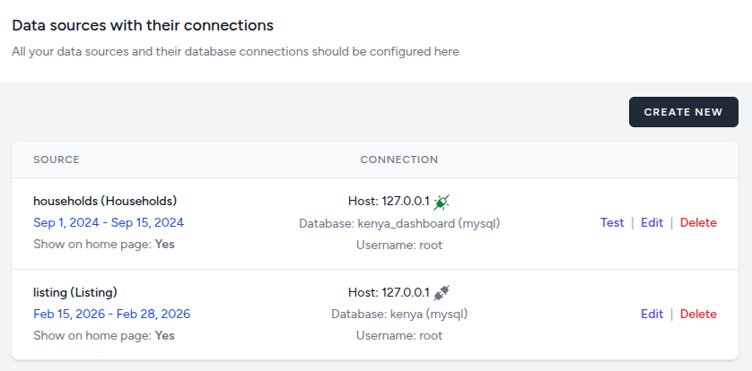

# Data Sources

Your dashboard can connect to and work with multiple data sources (databases). You do not need to be using CSPro for your census or survey — the dashboard works with any kind of data in any database as long as Laravel has a driver for it.

Out of the box, we support **MySQL**, **MariaDB**, **Microsoft SQL Server**, **PostgreSQL**, and **SQLite** databases as data sources.

## Creating a Data Source

If you are logged in with a Manager/Super Admin account, click the **Manage dashboard** button in the top bar and select **Data Sources** under *Core Configuration*. You should also have [Developer Mode](/advanced-topics/developer-mode) enabled, otherwise you will not be able to create new data sources.

To create a data source, you need to provide two sets of information:

1. **Source** — Information about the census/survey exercise.
2. **Connection** — The database connection parameters.

On the main Data Sources page, you can manage existing data sources — edit, test, or delete them. The **Test** feature allows you to verify that the connection to the database is working correctly.

## In the Sandbox

The training sandbox comes with a pre-loaded MySQL database containing approximately 5,000 cases of anonymized data from the Kenya Census conducted in 2019.

### Add the Kenya Census Data Source

1. Click **Manage dashboard** (Wrench icon, top right side) → **Data Sources**.
2. Click the **Create New** button.
3. Fill in the **Source** section:
   - **Name:** `kenya-census`
   - **Display Title:** `Kenya Census`
   - **Exercise Start Date:** Set to the start of the current month
   - **Exercise End Date:** Set to the end of the current month
   - **Case stats component:** Leave as default
   - **Show on home page:** Yes
   - **Rank:** Leave empty
 4. Fill in the **Connection** section with these values (these are the defaults set in your `.env` file — you can open it to verify):
    - **Database driver:** Leave as the default `MySQL 5.7+/MariaDB 10.3+`
    - **Host:** `mysql`
    - **Port:** `3306`
    - **Database:** `kenya_census`
    - **Username:** `sail`
    - **Password:** `password`
    - **Active:** Yes
    - **Also create QueryFragment class:** Yes
5. Submit the form to create the data source.
6. Use the **Test** button to verify that the database connection is working correctly.

> [!INFO]
> When the `QueryFragment class` option is enabled, a corresponding `QueryFragments` class will be automatically generated for you. This class handles geographic filtering for this data source. See [Query Fragments](/building-a-dashboard/query-fragments) for details.
