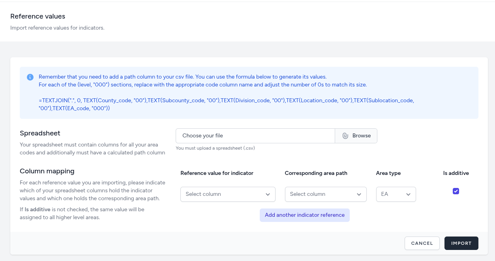

# Reference Values

What we generally refer to as reference values are concepts such as 'expected values' and 'target values'. These are used for comparing your actual data against so that you have some frame of reference to better understand the data/indicator you are viewing.

Reference values are typically sourced from previously published national data or international organizations such as UNSC, UNFPA, or the ILO.

To import reference values, you will need to have the data in a CSV file, and it needs to be at the lowest area hierarchy level (usually EA).

The file needs to have at least two columns. One for path (can be generated using the formula provided on the top of the form) of your lowest area hierarchy and another for the value of the reference value you are importing. It is common to have multiple columns, each named by the reference value they represent, in the same spreadsheet.

## Importing

The Reference Value Import interface provides a robust mechanism for bulk-loading external benchmarks into the dashboard via CSV spreadsheets. This process ensures that comparative data is precisely mapped to the correct geographic entities and indicators.

### Data Preparation Requirements
Before uploading, the spreadsheet must be formatted with specific columns to ensure compatibility with the system's hierarchical structure:

- **Area Codes and Path:** The file must contain columns for all area codes.

- **Calculated Path Column:** A mandatory "path" column is required to uniquely identify geographic units. The interface provides a functional Excel-style formula to help users generate these values by joining codes with a dot separator (e.g., County_code.Subcounty_code.EA_code). This is displayed on top of the form so it can be copied and pasted into your excel file.

### Column Mapping and Configuration
Once a file is selected, administrators must map their spreadsheet columns to the application’s internal fields:

- **Reference value for indicator:** Select the column containing the numeric benchmark values.

- **Corresponding area path:** Map the column containing the pre-calculated geographic path strings.

- **Area type:** Define the hierarchical level (e.g., EA, Sublocation) these specific values apply to.

- **Is additive:**

    - **Checked (Additive):** Use this for benchmarks that represent totals or absolute numbers (e.g., "Total Population Target"). These values are treated as summable components within the hierarchy and will be added to the parent area's value.

    - **Unchecked (Non-Additive):** Use this for rates, ratios, or percentages (e.g., "Birth Rate" or "Literacy Rate"). If this is not checked, the system recognizes that the value is a rate and will assign that specific value to the selected area without attempting to sum it into higher-level parent values.

### Multi-Indicator Imports
The interface supports the simultaneous import of multiple benchmarks. By clicking "Add another indicator reference," administrators can map additional columns from the same spreadsheet to different system indicators in a single operation.

## In the Sandbox

In the training sandbox repository, under the "training" directory, you will find a file named `reference_values.csv`. It contains reference values for two indicators: "population" and "number_of_hh" (number of households)

As there are thousands of areas (EAs) in the csv file, it will require sometime to complete. Once complete, you will receive a notification with the results.

Once the import process is complete, you can navigate to the Reference values management menu and view the values.
