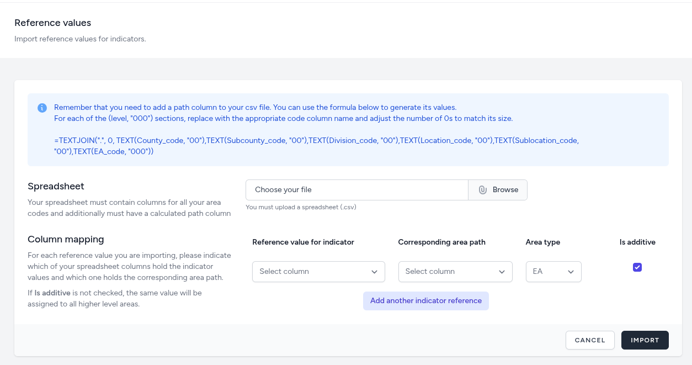

# Reference Values

**Reference values** are benchmark or target values used to compare your actual data against, providing a frame of reference to better understand the indicators you are viewing. They are commonly referred to as "expected values," "target values," or "population projections."

Reference values are typically sourced from previously published national data, census projections, or international organizations such as UNSC, UNFPA, or the ILO.

To import reference values, you need the data in a CSV file at the **lowest area hierarchy level** (usually EA). The file needs at least two columns:

1. A **path** column that uniquely identifies each geographic area. The import form displays an Excel-style formula you can use to generate this column by joining area codes with a dot separator (e.g., `County_code.Subcounty_code.EA_code`).
2. One or more columns for the reference values you are importing. It is common to have multiple columns in the same spreadsheet, each named after the indicator they represent.

## Importing Reference Values

The Reference Value Import interface provides a mechanism for bulk-loading external benchmarks into the dashboard via CSV spreadsheets. This process ensures that comparative data is precisely mapped to the correct geographic entities and indicators.

### Data Preparation Requirements

Before uploading, prepare your spreadsheet with the following.

Your spreadsheet must include a **`path`** column — each value is a dot-separated string of area codes that uniquely identifies a geographic unit (e.g., `01.01.01.01.01.001`). The import form displays a `TEXTJOIN` formula that shows exactly how to build this column from your individual area code columns, with the correct zero-padding for each level.

> [!TIP]
> If your spreadsheet already has separate columns for each area code (County_code, Subcounty_code, etc.), you can use the formula shown in the import form to generate the `path` column. If you are working with a pre-computed file (like the training sandbox file), the `path` column is already included and you can proceed directly to the import.

### Column Mapping and Configuration

Once a file is selected, map your spreadsheet columns to the application's internal fields:

- **Reference value for indicator:** Select the column containing the numeric benchmark values.
- **Corresponding area path:** Map the column containing the pre-calculated geographic path strings.
- **Area type:** Define the hierarchical level (e.g., EA, Sublocation) these values apply to.
- **Is additive:**
  - **Checked (Additive):** Use for benchmarks that represent totals or absolute numbers (e.g., "Total Population Target"). These values are treated as summable and will be aggregated up the hierarchy to parent areas.
  - **Unchecked (Non-Additive):** Use for rates, ratios, or percentages (e.g., "Birth Rate" or "Literacy Rate"). The system recognizes these as rates and assigns the value to the selected area without attempting to sum it into parent values.

### Multi-Indicator Imports

The interface supports importing multiple benchmarks simultaneously. Click **Add another indicator reference** to map additional columns from the same spreadsheet to different indicators in a single operation.

## In the Sandbox

In the training sandbox repository, under the `training` directory, you will find a file named `reference_values.csv`. It contains reference values for two indicators:

- **`population`** — Total population per EA
- **`number_of_hh`** — Number of households per EA

### Exercise

1. Navigate to **Manage dashboard** 🡒 **Core Configuration** 🡒 **Reference Values** (`/manage/developer/reference-value`).
2. Click the **Import** button.
3. Upload the file located at `./training/reference_values.csv`. The columns (`path`, `population`, `number_of_hh`) will appear in the dropdown menus.
4. Map the first indicator row:
   - **Reference value for indicator:** Select `population`.
   - **Corresponding area path:** Select `path`.
   - **Area type:** Keep `EA`.
   - **Is additive:** Keep checked (population is a total).
5. Click **Add another indicator reference** to add a second row.
6. Map the second indicator row:
   - **Reference value for indicator:** Select `number_of_hh`.
   - **Corresponding area path:** Select `path`.
   - **Area type:** Keep `EA`.
   - **Is additive:** Keep checked (number of households is a total).
7. Click **Import** to submit. The form will display *"The file is being imported. You will receive a notification when the process is complete."*

Since there are thousands of EAs in the file, the import will take some time to complete. Once finished, you will receive a notification with the results.

You can then navigate to the **Reference Values** management menu to view the imported values.
