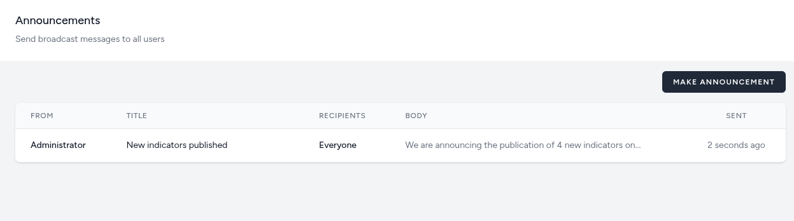
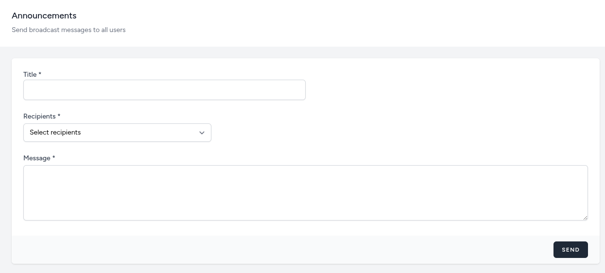

# Announcements

The **Announcements** module provides administrators with a direct communication channel to broadcast important updates, system notifications, or data insights to all or a specific group of dashboard users. This ensures that the entire user base — from field supervisors to national analysts — is informed of the latest changes or milestones in real time.

## Announcements List

The Announcements interface serves as a central log and control center for broadcast messages within the platform.

### Overview

The management table displays a history of all sent communications, allowing administrators to track what was sent and when.

- **From:** Identifies the sender of the announcement (e.g., Administrator).
- **Title:** A concise subject line that summarizes the notification (e.g., "New indicators published").
- **Recipients:** Specifies the audience receiving the message. This can be set to **Everyone** for general updates or targeted by role.
- **Body:** A preview of the actual message content.
- **Sent:** A timestamp indicating when the message was broadcast (e.g., "2 seconds ago").

## Making an Announcement

Administrators can initiate new communications by clicking the **Make Announcement** button.

### Announcement Configuration

To send a broadcast, complete the following fields:

- **Title:** Enter a clear, concise subject line. This is the first text users will see (e.g., "Scheduled Maintenance" or "Q3 Data Now Available").
- **Recipients:** A dropdown menu to define the target audience:
  - **Everyone:** All active users receive the update.
  - **By Role:** Target users based on their assigned roles (e.g., only Managers, only Viewers).
- **Message:** The main text area where the body of the announcement is composed. Include detailed information or instructions you wish to share with stakeholders.

### Common Use Cases

- Notifying users when new Indicators or Map Indicators have been published.
- Informing stakeholders of scheduled system maintenance.
- Highlighting specific regional data trends or census completion milestones.

### Sending and Visibility

- **Send Action:** Clicking the **Send** button immediately broadcasts the message to the selected recipients.
- **Broadcast History:** Once sent, the message is logged in the main Announcements management table, showing the sender's identity, the recipient group, and a "time ago" timestamp.

