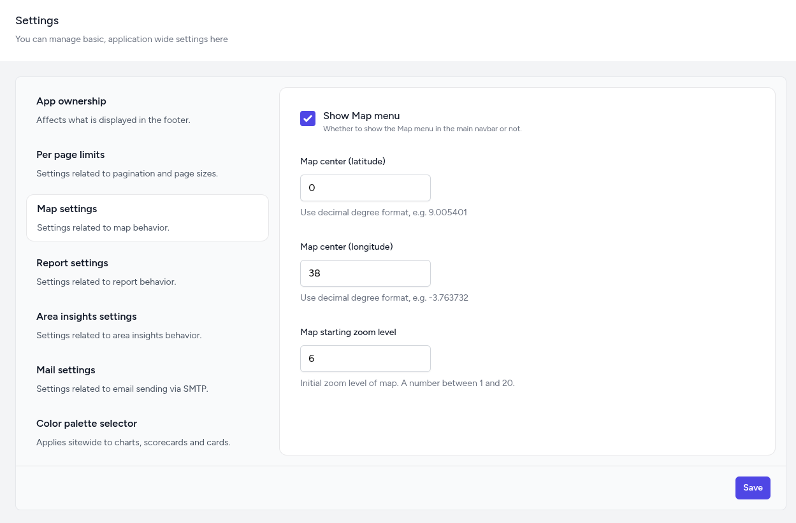

# Settings

The **Settings** module is the central location for system-wide configurations, allowing administrators to define the global behavior, appearance, and technical settings of the dashboard. Rather than a single long form, settings are organized into grouped tabs to separate related configurations.

Changes made here typically apply across all pages, indicators, and user sessions.

## Settings Groups

- **App Ownership** — Controls the core branding of the platform, specifically the organization name and website URL displayed in the application footer.

- **Per Page Limits** — Manages pagination settings, allowing you to define how many records or items are shown per page across different dashboard modules.

- **Map Settings** — Configures the primary geospatial behavior, including the default latitude/longitude center point, initial zoom levels, and whether the Map menu is visible in the main navigation bar.

- **Report Settings** — Controls whether the Report menu is visible in the main navigation bar.

- **Area Insights Settings** — Controls whether the Area Insights menu is visible in the main navigation bar.

- **Mail Settings** — Configures the SMTP server details, including host, port, authentication credentials, and encryption methods required for system-generated emails.

- **Color Palette Selector** — Allows sitewide selection of Categorical, Sequential, or Diverging color schemes applied to all charts, scorecards, and data cards.

