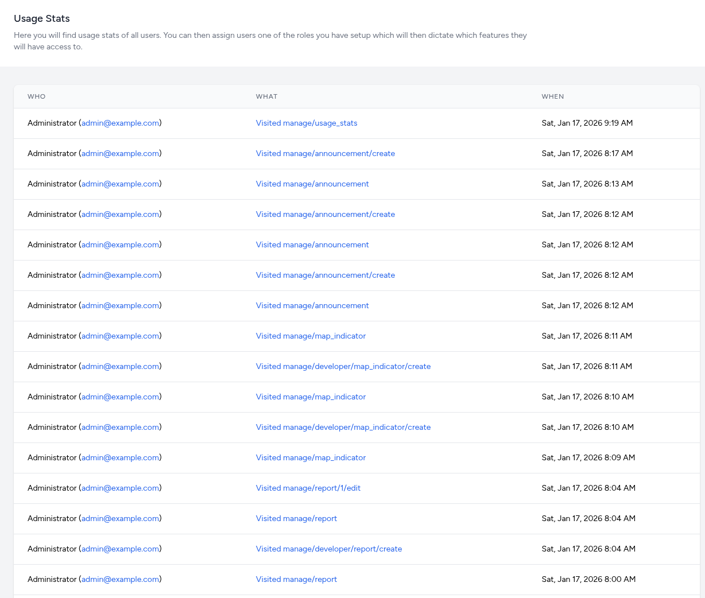

# Usage Stats

The **Usage Stats** module serves as a simplified telemetry and audit system. It captures a continuous stream of "visit" events, recording every instance a user navigates to a specific route within the dashboard.

The interface organizes route-tracking data into three primary columns to provide a clear history of system navigation:

- **Who:** Displays the user's role (e.g., Administrator) and their email address in parentheses.
- **What:** Records the specific URI or system route that was accessed. This allows for granular tracking of which tools are being utilized (e.g., `manage/indicators`, `manage/reports`).
- **When:** Provides the full date and high-precision timestamp for the visit (e.g., "Sat, Jan 17, 2026 8:12 AM").

## Interactive Filtering

The Usage Stats interface uses a dynamic **Click-to-Filter** system. Every blue link in the activity table acts as a shortcut to isolate and analyze specific parameters.

### Filtering by User (Who)

Clicking on a user's email address (displayed in blue) immediately refines the list to show only the actions taken by that specific individual.

- **Use Case:** If a configuration error is discovered, filter by that user to see their entire session history and understand the sequence of changes they made.
- **Security Audit:** Quickly verify if a specific account is accessing routes it should not be, or monitor the activity level of a new team member.

### Filtering by Route (What)

Clicking on a specific system path (e.g., `manage/indicators` or `manage/report/edit`) filters the log to show every time any user accessed that specific module.

- **Use Case:** If a specific report is failing, filter by that report's edit route to see who has modified it recently.
- **Feature Adoption:** Track how often developers are using "Create" routes versus "Edit" routes to gauge development activity.

### Breadcrumb & Clear Filters

Once a filter is applied, the interface displays a "breadcrumb" or "active filter" badge at the top of the table.

- **Resetting:** Click the **Clear Filter** (x icon) button to return to the full chronological log.

