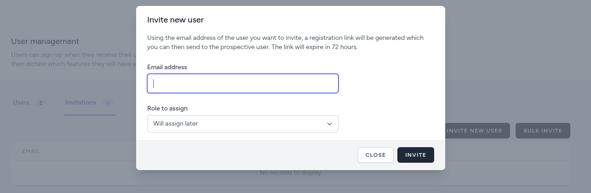
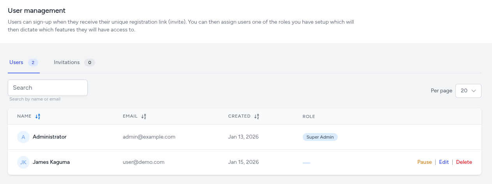

# Users

## Inviting Users

The dashboard can only be accessed by invitation. The dashboard manager invites pre-approved users by sending them a registration link (via email or other channels). Invitation links are:

- **One-time use** — Each link can only be used once.
- **Email-specific** — Tied to the recipient's email address.
- **Time-limited** — They expire after a set number of hours (configurable via `INVITATION_TTL_HOURS`).

Once a user registers, they can sign in and access the dashboard.

## Sending an Invitation

1. Navigate to the **Users** menu under the **Access Control** section of the Management dropdown. (If you do not see the Management menu, your account does not have the required permissions.)
2. On the user management page, switch to the **Invitations** tab and click the **Invite New User** button.
3. Fill in the details:
   - **Email Address:** The user's valid email.
   - **Role:** Select the appropriate role (e.g., Viewer, Manager). This is optional at this stage and can be assigned later.
4. Click **Invite**.

The user will receive an email with a unique registration link.

### Bulk Invites

If you need to invite a large number of users, use the **Bulk Invite** button to upload a list of users (an `.xlsx` or `.csv` file containing email addresses and corresponding roles).

## Managing Users

As a Manager, you can edit, suspend, delete, assign roles to, or geographically restrict existing user accounts.

### Editing a User

1. Click the **Edit** link next to their name.
2. You can update:
   - **Role:** Change their assigned role.
   - **Area restriction:** Change their geographic access restriction.
3. Click **Update**.

### Suspending a User

If you suspect a security breach or a user leaves the project:

1. Click the **Pause** icon next to their name.
2. The user will no longer be able to log in, but their data history is preserved. The link will change to **Resume**, allowing the manager to reinstate access at a later time.

### Deleting a User

:::danger
Deleting a user is permanent and cannot be reversed.
:::

1. Click the **Delete** button next to the user.
2. Confirm the action in the pop-up warning.
